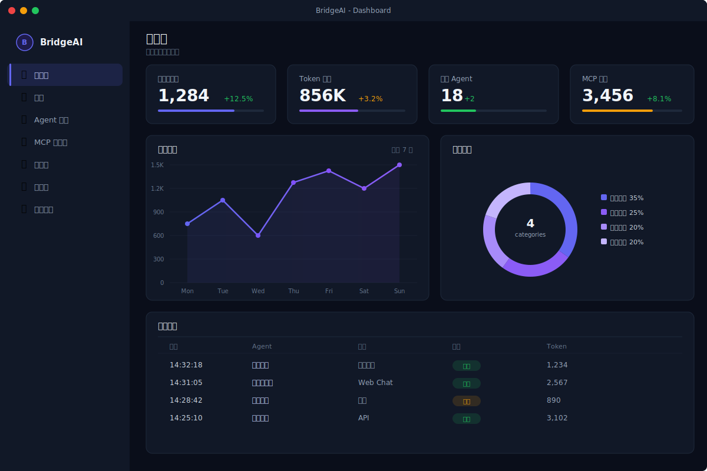
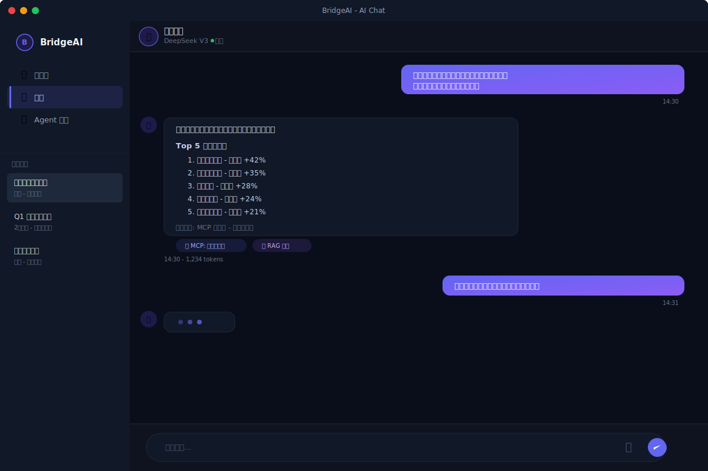
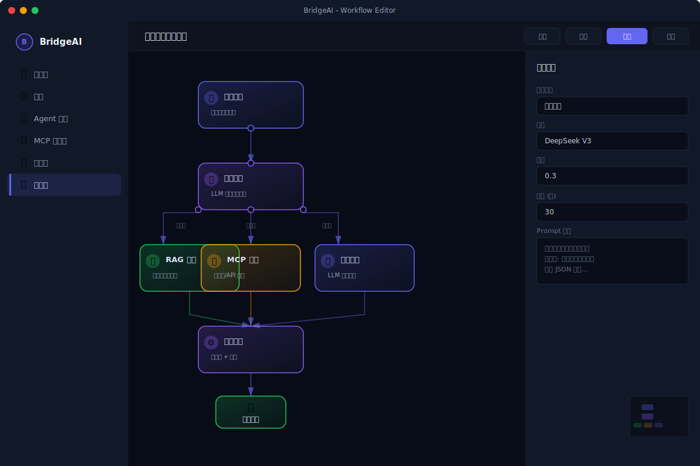
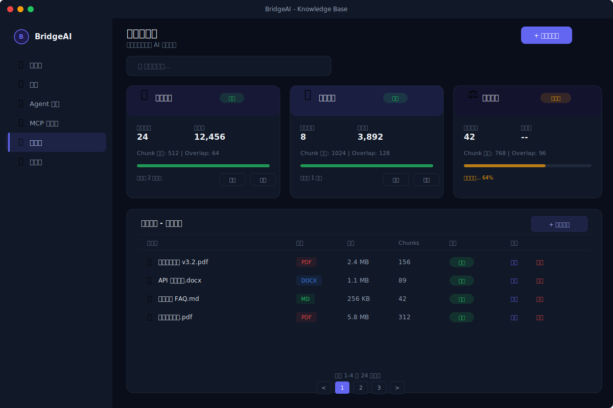
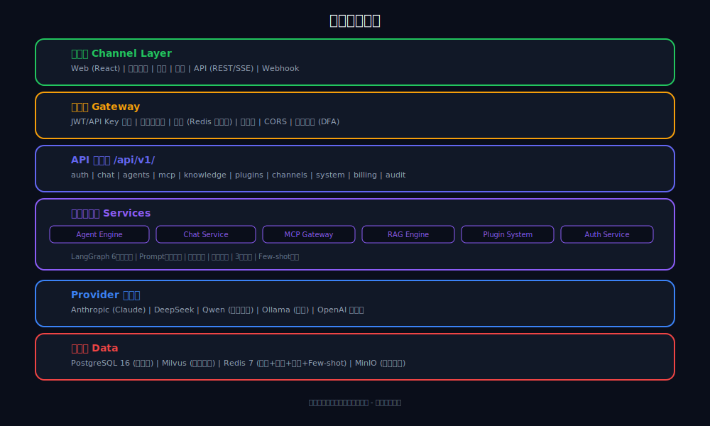
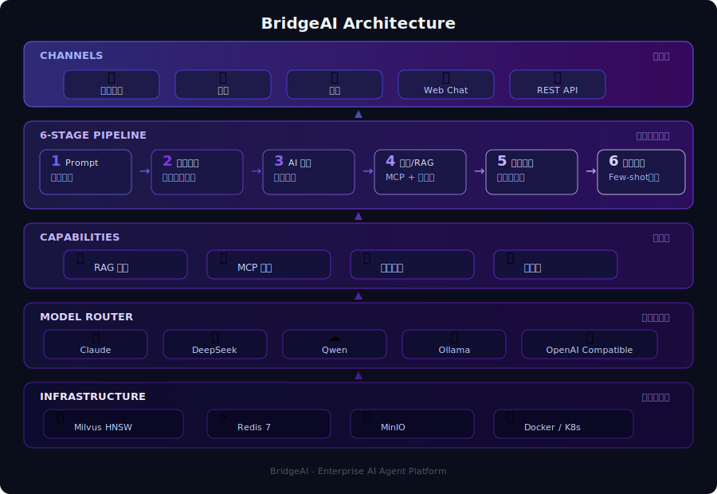

<div align="center">


# BridgeAI

### 企业 AI 中台 — 让 AI 连接一切

**一个开源的企业级 AI Agent 平台，3 分钟部署，开箱即用**

[](LICENSE)
[](https://python.org)
[](https://fastapi.tiangolo.com)
[](https://react.dev)
[](https://postgresql.org)
[](https://langchain-ai.github.io/langgraph/)
[](https://github.com/SourceSeeker-SameOrigin/BridgeAI)
[](https://github.com/SourceSeeker-SameOrigin/BridgeAI/releases)

</div>

[快速开始](#quick-start) |
[功能特性](#features) |
[架构设计](#architecture) |
[API 文档](#api-overview) |
[部署指南](docs/deployment.md) |
[贡献指南](CONTRIBUTING.md)


---

## 项目简介

BridgeAI 是一个开源的企业级智能 Agent 平台，帮助企业快速构建、部署和管理 AI Agent。通过 MCP (Model Context Protocol) 连接企业内部系统，结合 RAG 知识库和行业插件，让 AI 真正理解并服务企业业务。

**核心价值：**

- **零代码创建 Agent** -- 通过 Web 界面配置 Agent 人设、工具和知识库
- **连接企业系统** -- 通过 MCP 连接器对接数据库、API、飞书等企业工具
- **私有化部署** -- 支持国产大模型（DeepSeek、通义千问），数据不出企业
- **多渠道触达** -- 企业微信、钉钉、飞书一键接入

## Quick Start

```bash
# 1. 克隆项目
git clone https://github.com/SourceSeeker-SameOrigin/BridgeAI.git && cd BridgeAI

# 2. 启动基础设施（PostgreSQL + Redis + MinIO）
docker compose -f docker/docker-compose.dev.yml up -d

# 3. 启动后端
cd backend && cp .env.example .env   # 编辑 .env 填入你的 API Key
pip install -r requirements.txt
alembic upgrade head
uvicorn app.main:app --host 0.0.0.0 --port 8000 --reload
```

前端启动：

```bash
cd frontend && npm install && npm run dev
```

### 服务访问地址

| 服务 | 地址 | 说明 |
|------|------|------|
| **前端** | http://localhost:5173 | Web 管理界面 |
| **后端 API** | http://localhost:8000 | REST API |
| **API 文档** | http://localhost:8000/docs | Swagger 交互式文档 |
| **MinIO Console** | http://localhost:9001 | 对象存储管理（bridgeai / bridgeai_dev） |
| **Prometheus** | http://localhost:9090 | 监控指标 |
| **Grafana** | http://localhost:3001 | 监控大盘（admin / bridgeai） |
| **Milvus** | localhost:19530 | 向量数据库 |
| **PostgreSQL** | localhost:5432 | 关系型数据库 |
| **Redis** | localhost:6379 | 缓存 |
| **Ollama** | http://localhost:11434 | 本地 LLM / Embedding |

## Screenshots

<table>
<tr>
<td><br/>Dashboard</td>
<td><br/>AI Chat</td>
</tr>
<tr>
<td><br/>Workflow Editor</td>
<td><br/>Knowledge Base</td>
</tr>
</table>

## Architecture

<p align="center">
  
</p>



## Features

### Agent 引擎

- **LangGraph 6 阶段管线** -- 意图理解 → 上下文增强 → 工具选择 → 模型路由 → 执行 → 结果整合
- **3 层智能模型路由** -- 默认模型 → 意图自适应调整 → 用户等级控制
- **熔断降级链** -- 主模型失败自动切换备选模型，保障可用性
- **Prompt 四层融合** -- Agent 人设 + RAG 上下文 + Few-shot 示例 + 分析指令
- **流式输出 (SSE)** -- 实时逐字输出，支持工具调用状态推送
- **反馈学习** -- 用户评分驱动 Few-shot 案例池自动优化

### MCP 连接器

- **多类型支持** -- MySQL/PostgreSQL 数据库、HTTP API、飞书
- **即插即用** -- Web 界面配置连接信息即可使用
- **安全机制** -- 参数校验、输出脱敏（手机号/身份证/银行卡）、调用审计
- **网关管理** -- 连接器注册/注销、健康检查、工具列表发现

### RAG 知识库

- **多格式解析** -- PDF、DOCX、Markdown、纯文本
- **智能切分** -- 可配置 chunk_size 和 overlap
- **向量检索** -- Milvus HNSW 向量检索
- **后台处理** -- 文档上传后异步解析入库，不阻塞用户

### 行业插件

- **插件基类** -- 标准化工具定义和执行接口
- **内置行业** -- 跨境电商、财税、法律
- **提示模板** -- 每个插件可携带行业专属提示词
- **动态加载** -- 运行时发现和注册插件

### 渠道接入

- **企业微信** -- 消息接收/回复、事件验签、Access Token 管理
- **钉钉机器人** -- Webhook 回复、主动推送
- **统一路由** -- 所有渠道消息统一进入 Agent 管线处理

### 平台能力

- **多租户隔离** -- 租户级数据隔离，API Key + JWT 双认证
- **用量计费** -- Token 消耗和 MCP 调用次数统计
- **审计日志** -- 全链路操作记录，支持合规审计
- **仪表盘** -- 对话量、Token 消耗、意图分布、情感分析可视化

## Tech Stack


| 层级           | 技术选型                 | 说明                            |
| -------------- | ------------------------ | ------------------------------- |
| **后端框架**   | FastAPI + Uvicorn        | 异步高性能 Python Web 框架      |
| **Agent 引擎** | LangGraph                | 基于状态机的 Agent 编排框架     |
| **数据库**     | PostgreSQL 16 + Milvus   | 关系型数据 + 向量检索           |
| **缓存**       | Redis 7                  | 会话缓存、Few-shot 池、熔断状态 |
| **ORM**        | SQLAlchemy 2.0 (async)   | 异步数据库访问                  |
| **数据迁移**   | Alembic                  | 数据库版本管理                  |
| **认证**       | JWT + API Key            | 双模式认证                      |
| **前端**       | React 18 + TypeScript    | 现代前端技术栈                  |
| **状态管理**   | Zustand                  | 轻量级状态管理                  |
| **构建工具**   | Vite                     | 快速开发构建                    |
| **文件存储**   | MinIO                    | S3 兼容对象存储                 |
| **容器化**     | Docker Compose           | 一键开发/生产部署               |
| **LLM 支持**   | Claude / DeepSeek / Qwen | 多模型支持，可私有部署          |

## API Overview

所有 API 均以 `/api/v1` 为前缀，统一响应格式：

```json
{
  "code": 200,
  "message": "success",
  "data": { ... }
}
```


| 模块       | 端点                                  | 说明                        |
| ---------- | ------------------------------------- | --------------------------- |
| **认证**   | `POST /auth/login`                    | 用户登录，返回 JWT          |
|            | `POST /auth/register`                 | 用户注册                    |
| **对话**   | `POST /chat/completions`              | 发送消息（支持流式/非流式） |
|            | `POST /chat/messages/{id}/rate`       | 消息评分                    |
| **Agent**  | `POST /agents`                        | 创建 Agent                  |
|            | `GET /agents`                         | 获取 Agent 列表（分页）     |
|            | `PUT /agents/{id}`                    | 更新 Agent                  |
|            | `DELETE /agents/{id}`                 | 删除 Agent                  |
| **MCP**    | `POST /mcp`                           | 创建连接器                  |
|            | `GET /mcp/{id}/tools`                 | 获取连接器工具列表          |
|            | `POST /mcp/{id}/execute`              | 执行工具                    |
|            | `POST /mcp/{id}/test`                 | 测试连接                    |
| **知识库** | `POST /knowledge`                     | 创建知识库                  |
|            | `POST /knowledge/{id}/documents`      | 上传文档                    |
|            | `POST /knowledge/{id}/search`         | 语义搜索                    |
| **插件**   | `GET /plugins`                        | 获取可用插件列表            |
|            | `POST /plugins/{name}/enable`         | 启用插件                    |
| **渠道**   | `GET /channels`                       | 获取渠道状态                |
|            | `POST /channels/wechat-work/callback` | 企业微信回调                |
|            | `POST /channels/dingtalk/callback`    | 钉钉回调                    |
| **系统**   | `GET /system/health`                  | 健康检查                    |
|            | `GET /system/models`                  | 可用模型列表                |
|            | `GET /system/stats`                   | 仪表盘统计数据              |
| **审计**   | `GET /audit/logs`                     | 审计日志查询                |
| **计费**   | `GET /billing/usage`                  | 用量统计                    |

完整 API 文档请参考 [API Reference](docs/api-reference.md) 或启动后访问 `/docs`。

## Configuration

环境变量配置参考 [.env.example](.env.example)：


| 变量                | 必填 | 说明                             |
| ------------------- | :--: | -------------------------------- |
| `DATABASE_URL`      |  是  | PostgreSQL 连接字符串            |
| `REDIS_URL`         |  是  | Redis 连接字符串                 |
| `JWT_SECRET`        |  是  | JWT 签名密钥（生产环境务必修改） |
| `DEEPSEEK_API_KEY`  | 否* | DeepSeek API Key                 |
| `ANTHROPIC_API_KEY` | 否* | Anthropic (Claude) API Key       |
| `QWEN_API_KEY`      | 否* | 通义千问 API Key                 |
| `MINIO_ENDPOINT`    |  否  | MinIO 端点                       |
| `WECHAT_WORK_*`     |  否  | 企业微信接入配置                 |
| `DINGTALK_*`        |  否  | 钉钉接入配置                     |

> *至少配置一个 LLM Provider 的 API Key

## Deployment

### 开发环境

```bash
docker compose -f docker/docker-compose.dev.yml up -d  # 基础设施
cd backend && uvicorn app.main:app --reload             # 后端热重载
cd frontend && npm run dev                              # 前端热重载
```

### 生产部署

```bash
docker compose -f docker/docker-compose.yml up -d       # 全栈部署
```

### 私有化部署

BridgeAI 支持完全私有化部署，推荐配合国产大模型使用：

- 使用 DeepSeek 或通义千问作为 LLM 后端
- 使用 Ollama 运行本地模型（无需外网）
- 所有数据存储在企业内部，不外传

详细部署指南请参考 [部署文档](docs/deployment.md)。

## Project Structure

```
BridgeAI/
├── backend/                  # Python 后端
│   ├── app/
│   │   ├── main.py           # FastAPI 入口
│   │   ├── config.py         # 配置管理
│   │   ├── api/v1/           # API 路由层
│   │   ├── services/         # 业务逻辑层
│   │   ├── models/           # ORM 模型
│   │   ├── schemas/          # Pydantic 数据模型
│   │   ├── engine/           # Agent 管线引擎
│   │   ├── agents/           # 模型路由 + 熔断器
│   │   ├── mcp/              # MCP 网关 + 连接器
│   │   ├── rag/              # RAG 引擎
│   │   ├── plugins/          # 行业插件
│   │   ├── channels/         # 渠道接入
│   │   ├── providers/        # LLM 提供商适配
│   │   └── middleware/       # 中间件
│   ├── migrations/           # Alembic 数据库迁移
│   └── tests/                # 测试
├── frontend/                 # React 前端
├── docker/                   # Docker 配置
├── scripts/                  # 运维脚本
├── docs/                     # 项目文档
└── blueprint/                # 产品蓝图
```

## Contributing

欢迎贡献代码！请阅读 [贡献指南](CONTRIBUTING.md) 了解开发流程和代码规范。

## License

本项目采用 [MIT License](LICENSE) 开源协议。

---

<div align="center">

**如果 BridgeAI 对你有帮助，请给个 Star 支持一下！**

<!-- Star History -->

[](https://star-history.com/#SourceSeeker-SameOrigin/BridgeAI&Date)

</div>
