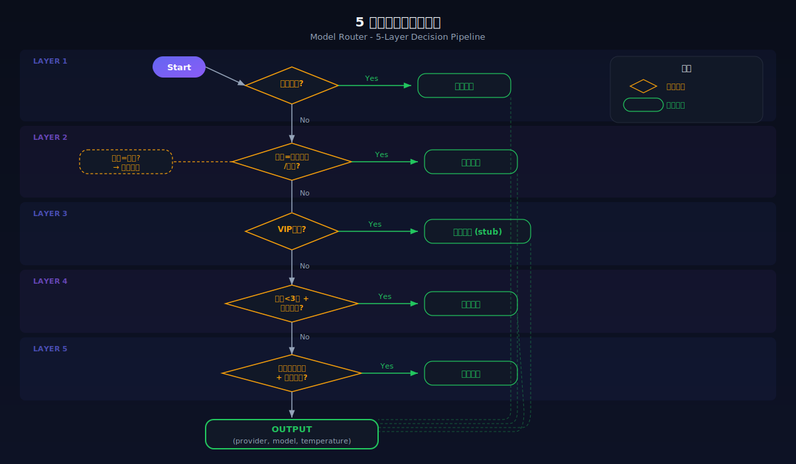
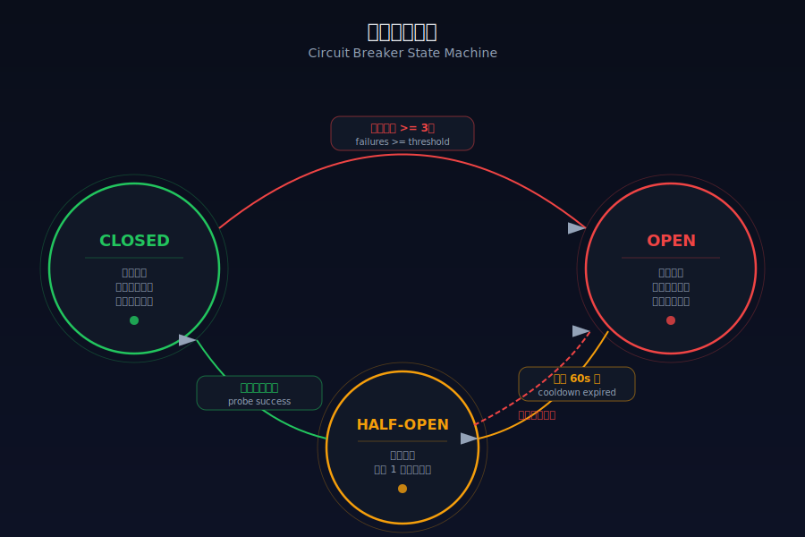
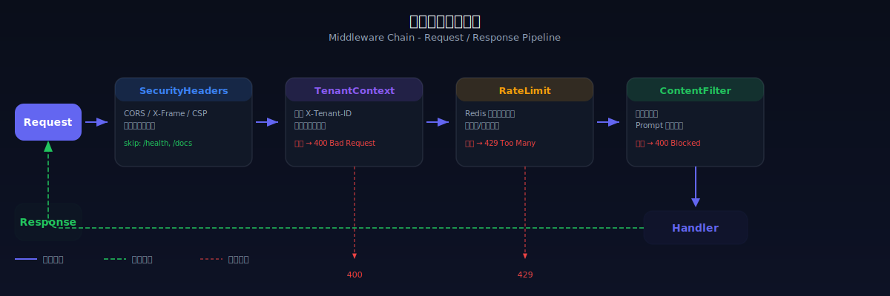
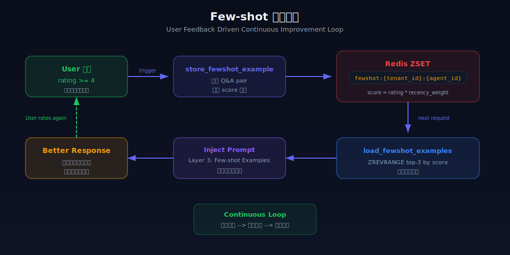
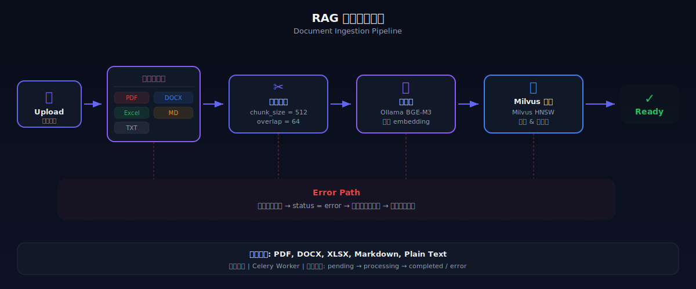

# BridgeAI - 技术架构详细设计

> 版本：v0.3.0 | 起草日期：2026-04-01 | 更新：2026-04-01 | 状态：待确认
> 参考项目：Fortune AI Agent（管线、路由、Prompt融合、记忆、熔断降级）
> v0.3 变更：上下文分析改为大模型一次性输出，删除规则引擎，管线 7→6 阶段

## 一、项目目录结构

```
BridgeAI/
├── blueprint/                    # 产品蓝图（方案文档）
│   ├── 00-product-overview.md    # 产品总览
│   ├── 01-tech-architecture.md   # 技术架构（本文档）
│   ├── 02-iteration-plan.md      # 迭代计划
│   └── changelog.md              # 方案变更记录
│
├── backend/                      # Python 后端
│   ├── app/
│   │   ├── main.py               # FastAPI 入口
│   │   ├── config.py             # 全局配置
│   │   ├── dependencies.py       # 依赖注入
│   │   │
│   │   ├── api/                  # API 路由
│   │   │   └── v1/
│   │   │       ├── auth.py       # 认证接口
│   │   │       ├── chat.py       # 对话接口
│   │   │       ├── agents.py     # Agent 管理
│   │   │       ├── mcp.py        # MCP 连接器管理
│   │   │       ├── knowledge.py  # 知识库管理
│   │   │       ├── plugins.py    # 插件管理
│   │   │       └── system.py     # 系统管理
│   │   │
│   │   ├── core/                 # 核心逻辑
│   │   │   ├── security.py       # JWT、加密、权限
│   │   │   ├── database.py       # 数据库连接
│   │   │   ├── redis.py          # Redis 连接
│   │   │   └── exceptions.py     # 自定义异常
│   │   │
│   │   ├── models/               # SQLAlchemy ORM 模型
│   │   │   ├── user.py
│   │   │   ├── agent.py
│   │   │   ├── conversation.py
│   │   │   ├── mcp.py
│   │   │   ├── knowledge.py
│   │   │   └── plugin.py
│   │   │
│   │   ├── schemas/              # Pydantic 数据模型
│   │   │   ├── auth.py
│   │   │   ├── chat.py
│   │   │   ├── agent.py
│   │   │   ├── mcp.py
│   │   │   ├── knowledge.py
│   │   │   └── plugin.py
│   │   │
│   │   ├── services/             # 业务逻辑层
│   │   │   ├── auth_service.py
│   │   │   ├── chat_service.py
│   │   │   ├── agent_service.py
│   │   │   ├── mcp_service.py
│   │   │   ├── knowledge_service.py
│   │   │   └── plugin_service.py
│   │   │
│   │   ├── agents/               # Agent 引擎
│   │   │   ├── engine.py         # LangGraph 引擎核心（7阶段管线）
│   │   │   ├── memory.py         # 3级记忆管理（工作/短期/长期）
│   │   │   ├── planner.py        # 任务规划器（含子任务委派）
│   │   │   ├── executor.py       # 工具执行器
│   │   │   ├── model_router.py   # 智能模型路由（5层决策树）
│   │   │   ├── circuit_breaker.py # 熔断降级管理
│   │   │   └── templates/        # Agent 预置模板
│   │   │       ├── customer_service.py
│   │   │       ├── data_analyst.py
│   │   │       └── office_assistant.py
│   │   │
│   │   ├── engine/               # 上下文引擎
│   │   │   ├── context_parser.py     # 解析大模型输出的 <analysis> JSON
│   │   │   ├── prompt_optimizer.py   # Prompt 四层融合（含分析指令注入）
│   │   │   └── feedback_loop.py      # Few-shot 学习循环
│   │   │
│   │   ├── mcp/                  # MCP 网关
│   │   │   ├── gateway.py        # MCP 网关核心
│   │   │   ├── registry.py       # 连接器注册中心
│   │   │   ├── audit.py          # 调用审计
│   │   │   └── connectors/       # MCP 连接器实现
│   │   │       ├── base.py       # 连接器基类
│   │   │       ├── feishu.py     # 飞书连接器
│   │   │       ├── mysql_conn.py # MySQL 连接器
│   │   │       ├── dingtalk.py   # 钉钉连接器
│   │   │       └── http_api.py   # 通用 HTTP API 连接器
│   │   │
│   │   ├── rag/                  # RAG 引擎
│   │   │   ├── engine.py         # RAG 核心逻辑
│   │   │   ├── embeddings.py     # 向量化
│   │   │   ├── chunker.py        # 文档切分
│   │   │   ├── retriever.py      # 检索器
│   │   │   └── parsers/          # 文档解析器
│   │   │       ├── pdf_parser.py
│   │   │       ├── docx_parser.py
│   │   │       └── markdown_parser.py
│   │   │
│   │   ├── plugins/              # 行业插件
│   │   │   ├── base.py           # 插件基类
│   │   │   ├── registry.py       # 插件注册中心
│   │   │   ├── loader.py         # 动态加载器
│   │   │   └── industries/       # 行业插件实现
│   │   │       ├── ecommerce/    # 跨境电商
│   │   │       ├── finance/      # 财税
│   │   │       ├── legal/        # 法律
│   │   │       └── education/    # 教育
│   │   │
│   │   ├── channels/             # 渠道接入
│   │   │   ├── base.py           # 渠道基类
│   │   │   ├── wechat_work.py    # 企业微信
│   │   │   ├── dingtalk_bot.py   # 钉钉机器人
│   │   │   ├── feishu_bot.py     # 飞书机器人
│   │   │   └── webhook.py        # 通用 Webhook
│   │   │
│   │   ├── providers/             # LLM 提供商适配（参考 Fortune AI Adapter 模式）
│   │   │   ├── base.py           # 提供商基类
│   │   │   ├── registry.py       # 提供商注册中心（自动发现）
│   │   │   ├── anthropic.py      # Claude 适配
│   │   │   ├── deepseek.py       # DeepSeek 适配
│   │   │   ├── qwen.py           # 通义千问适配
│   │   │   ├── openai_compat.py  # OpenAI 兼容适配
│   │   │   └── ollama.py         # Ollama 本地模型适配
│   │   │
│   │   └── middleware/           # 中间件
│   │       ├── rate_limit.py     # 限流（Redis 令牌桶）
│   │       ├── audit_log.py      # 审计日志
│   │       ├── tenant.py         # 4维多租户隔离
│   │       └── content_filter.py # 敏感词过滤（DFA 算法）
│   │
│   ├── tests/                    # 测试
│   │   ├── conftest.py
│   │   ├── test_chat.py
│   │   ├── test_agents.py
│   │   ├── test_mcp.py
│   │   └── test_rag.py
│   │
│   ├── migrations/               # Alembic 数据库迁移
│   ├── pyproject.toml            # Python 项目配置
│   ├── requirements.txt          # 依赖
│   └── Dockerfile
│
├── frontend/                     # React 前端
│   ├── src/
│   │   ├── main.tsx
│   │   ├── App.tsx
│   │   ├── routes.tsx            # 路由配置
│   │   │
│   │   ├── api/                  # API 请求
│   │   │   ├── client.ts         # Axios 实例
│   │   │   ├── auth.ts
│   │   │   ├── chat.ts
│   │   │   ├── agents.ts
│   │   │   ├── mcp.ts
│   │   │   └── knowledge.ts
│   │   │
│   │   ├── stores/               # Zustand 状态管理
│   │   │   ├── authStore.ts
│   │   │   ├── chatStore.ts
│   │   │   └── agentStore.ts
│   │   │
│   │   ├── pages/                # 页面
│   │   │   ├── Login/
│   │   │   ├── Dashboard/
│   │   │   ├── Chat/             # 对话界面
│   │   │   ├── Agents/           # Agent 管理
│   │   │   ├── MCP/              # MCP 连接器
│   │   │   ├── Knowledge/        # 知识库
│   │   │   ├── Plugins/          # 插件市场
│   │   │   ├── AuditLog/         # 审计日志
│   │   │   └── Settings/         # 系统设置
│   │   │
│   │   ├── components/           # 通用组件
│   │   │   ├── Layout/
│   │   │   ├── ChatMessage/
│   │   │   ├── MarkdownRenderer/
│   │   │   └── FileUploader/
│   │   │
│   │   └── utils/                # 工具函数
│   │
│   ├── index.html
│   ├── vite.config.ts
│   ├── tsconfig.json
│   ├── package.json
│   └── Dockerfile
│
├── docker/
│   ├── docker-compose.yml        # 开发环境
│   ├── docker-compose.prod.yml   # 生产环境
│   ├── nginx.conf                # Nginx 配置
│   └── init-db.sql               # 数据库初始化
│
├── scripts/
│   ├── setup.sh                  # 一键环境搭建
│   ├── deploy.sh                 # 部署脚本
│   └── seed_data.py              # 种子数据
│
├── .env.example                  # 环境变量模板
├── .gitignore
└── LICENSE                       # MIT License
```

## 二、核心模块交互流程

### 2.1 6 阶段对话处理管线

> 上下文分析（情绪/意图/复杂度）不再用规则引擎，
> 而是在 Prompt 中注入分析指令，大模型回答时同时输出 JSON 分析。
> 一次调用 = 回答 + 分析，省掉一个阶段和一次模型调用。

<p align="center">
  
</p>

```
用户发送消息（Web/企微/钉钉/飞书/API）
    │
    ▼
┌─── ① 请求接入 (Channel Layer) ───────────────────────────┐
│  统一消息格式 → 提取 tenant/user/session → 内容过滤       │
│  设置 TenantContext → 异步传播到后续所有操作               │
└───────────────────────────────────────────────────────────┘
    │
    ▼
┌─── ② Prompt 融合 (PromptOptimizer) ─────────────────────┐
│  Layer 1: Agent System Prompt（人设/角色/专业领域）        │
│  Layer 2: 记忆摘要 + RAG 检索结果                         │
│  Layer 3: Few-shot 高评分案例（Redis ZSET Top-3）          │
│  Layer 4: 上下文分析指令（要求模型输出 <analysis> JSON）    │
│           → 情绪/意图/复杂度/关键事实 由大模型一次性判断    │
└───────────────────────────────────────────────────────────┘
    │
    ▼
┌─── ③ 智能模型路由 (ModelRouter) ─────────────────────────┐
│  首次对话 → 使用 Agent 默认模型                            │
│  后续对话 → 基于上一轮分析结果的 intent/complexity 调整     │
│  用户等级调整 → 成本控制                                   │
│  输出: 最优模型 ID + 参数配置                              │
└───────────────────────────────────────────────────────────┘
    │
    ▼
┌─── ④ AI 调用 (LLM Provider + CircuitBreaker) ───────────┐
│                                                           │
│  主模型调用 ──失败──▶ 降级模型1 ──失败──▶ 降级模型2 ──...  │
│       │                                                   │
│       ▼                                                   │
│  [工具调用?] ──是──▶ MCP Gateway 执行工具                  │
│       │              ├── 权限检查 → 参数校验 → 执行         │
│       │              ├── 脱敏处理 → 结果格式化              │
│       │              └── 审计记录                          │
│       │                                                   │
│  [子任务委派?] ──是──▶ 子 Agent 独立处理                   │
│       │                                                   │
│  [需要知识?] ──是──▶ RAG Engine 混合检索                   │
│       │                                                   │
│  [需要行业能力?] ──是──▶ Plugin 加载                       │
└───────────────────────────────────────────────────────────┘
    │
    ▼
┌─── ⑤ 响应解析与持久化 ──────────────────────────────────┐
│  解析模型输出:                                             │
│    ├── 回复内容（去掉 <analysis> 标签）→ 流式输出给用户     │
│    └── <analysis> JSON → 解析为 ContextAnalysis 对象       │
│        ├── emotion → 存入 message_emotions 表              │
│        ├── intent → 存入 message_intents 表                │
│        ├── key_facts → 写入记忆系统（Redis + DB）           │
│        └── complexity → 缓存，供下一轮模型路由使用          │
│  异步持久化: 消息→DB, 历史→Redis, 使用量→统计表            │
└───────────────────────────────────────────────────────────┘
    │
    ▼
┌─── ⑥ 反馈学习 (Feedback Loop) ──────────────────────────┐
│  用户评分(1-5星) → ≥4星自动存入 Few-shot 候选池            │
│  Redis ZSET: key="fewshot:{tenant}:{agent}", score=rating │
│  下次对话时自动注入为 Prompt Layer 3 的示例                 │
└───────────────────────────────────────────────────────────┘
```

### 2.2 MCP 调用流程

```
Agent 需要调用工具
    │
    ▼
[MCP Gateway] 接收调用请求
    │
    ├──▶ 权限检查：该 Agent 是否有权限调用此工具？
    │
    ├──▶ 参数校验：输入参数是否合法？
    │
    ├──▶ 路由分发：找到对应的 MCP Server
    │
    ├──▶ 执行调用：通过 MCP 协议调用工具
    │
    ├──▶ 结果处理：
    │       ├── 脱敏（手机号、身份证等）
    │       ├── 格式化
    │       └── 截断（防止超长输出）
    │
    ├──▶ 审计记录：写入 mcp_audit_logs
    │
    ▼
返回结果给 Agent
```

### 2.3 RAG 文档处理流程

```
用户上传文档
    │
    ▼
[文档解析] PDF/DOCX/MD → 纯文本
    │
    ▼
[文本切分] 按 chunk_size 切分，保留 overlap
    │
    ▼
[向量化] 调用 Embedding 模型生成向量
    │
    ▼
[存储] 写入 knowledge_chunks 表 (content + vector)
    │
    ▼
[索引] IVFFlat 索引自动更新

--- 查询时 ---

用户提问
    │
    ▼
[Query Embedding] 问题向量化
    │
    ▼
[向量检索] cosine similarity top-K
    │
    ▼
[重排序] 可选：用 Reranker 模型精排
    │
    ▼
[注入上下文] 将检索结果作为 context 注入 Agent prompt
```

## 三、从 Fortune AI Agent 借鉴的核心设计

### 3.0.1 智能模型路由器

<p align="center">
  
</p>

```python
class ModelRouter:
    """5 层决策树，自动选择最优模型"""

    async def select_model(self, context: ContextAnalysis) -> ModelSelection:
        model = self.config.default_model

        # Layer 1: 按意图选模型
        intent_model = self.intent_model_map.get(context.intent)
        if intent_model:
            model = intent_model

        # Layer 2: 复杂度调整
        if context.complexity == "high":
            model = self.upgrade_model(model)

        # Layer 3: 用户等级
        if context.user_tier == "vip":
            model = self.premium_model(model)

        # Layer 4: 性能优化（对话初期用快模型）
        if context.intent == "small_talk" and context.history_length < 3:
            model = self.fast_model(model)

        # Layer 5: 成本控制
        if self.cost_optimization_enabled:
            model = self.optimize_cost(model)

        return ModelSelection(model=model, fallback_chain=self.fallback_chain)
```

### 3.0.2 熔断降级链

<p align="center">
  
</p>

```python
class CircuitBreaker:
    """模型调用熔断器，失败自动切换下一个模型"""

    def __init__(self, fallback_chain: list[str], failure_threshold: int = 3):
        self.fallback_chain = fallback_chain
        self.failure_threshold = failure_threshold
        self.failure_counts: dict[str, int] = {}
        self.circuit_open_until: dict[str, float] = {}

    async def call_with_fallback(self, prompt, primary_model: str) -> Response:
        chain = [primary_model] + [m for m in self.fallback_chain if m != primary_model]
        for model in chain:
            if self.is_circuit_open(model):
                continue
            try:
                return await self.call_model(model, prompt, timeout=30)
            except Exception:
                self.record_failure(model)
        raise AllModelsFailedError("所有模型均不可用")
```

### 3.0.3 Prompt 四层融合器（含上下文分析指令）

<p align="center">
  
</p>

```python
# 上下文分析指令 — 要求大模型在回复末尾输出结构化分析
CONTEXT_ANALYSIS_INSTRUCTION = """
在回答用户问题后，请在回复末尾输出分析（用 <analysis> 标签包裹，不要向用户提及）：
<analysis>
{
  "emotion": "positive|negative|confused|urgent|neutral",
  "intent": "用一句话描述用户的真实意图",
  "complexity": "low|medium|high",
  "key_facts": ["从对话中提取的值得记住的关键信息"],
  "needs_tool": true|false,
  "suggested_tools": ["工具名称"]
}
</analysis>
"""


class PromptOptimizer:
    """四层 Prompt 融合，大模型同时完成回答+上下文分析"""

    async def optimize(self, agent: Agent, prev_analysis: ContextAnalysis | None) -> str:
        layers = []

        # Layer 1: Agent 人设
        layers.append(agent.system_prompt)

        # Layer 2: 记忆 + RAG
        memory_facts = await self.memory_manager.retrieve(agent)
        if memory_facts:
            layers.append("已知信息:\n" + "\n".join(memory_facts))
        rag_results = await self.rag_engine.search(agent.knowledge_base_id)
        if rag_results:
            layers.append("参考资料:\n" + "\n".join(rag_results))

        # Layer 3: Few-shot 高评分案例
        examples = await self.get_fewshot_examples(agent.id, top_k=3)
        if examples:
            layers.append("优秀回答示例:\n" + self.format_examples(examples))

        # Layer 4: 上下文分析指令（核心创新 — 让大模型一次性输出分析）
        layers.append(CONTEXT_ANALYSIS_INSTRUCTION)

        return "\n\n".join(layers)
```

### 3.0.3.1 响应解析器

```python
import re
import json
from dataclasses import dataclass


@dataclass
class ContextAnalysis:
    emotion: str           # positive/negative/confused/urgent/neutral
    intent: str            # 自由文本意图描述
    complexity: str        # low/medium/high
    key_facts: list[str]   # 关键事实
    needs_tool: bool
    suggested_tools: list[str]


class ContextParser:
    """从大模型回复中分离内容和分析"""

    ANALYSIS_PATTERN = re.compile(
        r"<analysis>\s*(\{.*?\})\s*</analysis>",
        re.DOTALL
    )

    def parse(self, raw_response: str) -> tuple[str, ContextAnalysis | None]:
        """返回 (用户可见内容, 上下文分析)"""
        match = self.ANALYSIS_PATTERN.search(raw_response)
        if not match:
            return raw_response.strip(), None

        # 分离内容和分析
        content = self.ANALYSIS_PATTERN.sub("", raw_response).strip()
        try:
            data = json.loads(match.group(1))
            analysis = ContextAnalysis(**data)
        except (json.JSONDecodeError, TypeError):
            analysis = None

        return content, analysis
```

### 3.0.4 3 级记忆管理

<p align="center">
  
</p>

<p align="center">
  
</p>

<p align="center">
  
</p>

```python
class MemoryManager:
    """3级记忆：工作记忆(dict) → 短期(Redis) → 长期(DB+向量)"""

    async def retrieve(self, tenant_id, user_id, agent_id, query: str) -> list[MemoryItem]:
        # Level 1: 工作记忆（当前会话的临时状态）
        working = self.working_memory.get(f"{tenant_id}:{user_id}:{agent_id}")

        # Level 2: 短期记忆（Redis, 7天TTL）
        key = f"memory:{tenant_id}:{user_id}:{agent_id}"
        short_term = await self.redis.get(key)

        # Level 3: 长期记忆（DB + 向量语义检索）
        query_embedding = await self.embed(query)
        long_term = await self.db.query(
            "SELECT * FROM agent_memories "
            "WHERE tenant_id=$1 AND user_id=$2 "
            "ORDER BY embedding <=> $3 LIMIT 5",
            tenant_id, user_id, query_embedding
        )

        return self.merge_and_rank(working, short_term, long_term)
```

### 3.0.5 4 维多租户隔离

```python
class TenantMiddleware:
    """4维隔离: tenant × user × agent × session"""

    async def __call__(self, request: Request, call_next):
        tenant_id = request.headers.get("X-Tenant-Id", "default")
        user_id = request.headers.get("X-User-Id")

        # 设置上下文（asyncio Task-local，异步安全）
        token = tenant_context.set(TenantContext(
            tenant_id=tenant_id,
            user_id=user_id
        ))
        try:
            response = await call_next(request)
            return response
        finally:
            tenant_context.reset(token)

# SQLAlchemy 事件监听器：自动给所有查询加 WHERE tenant_id = ?
@event.listens_for(Session, "do_orm_execute")
def add_tenant_filter(orm_execute_state):
    ctx = tenant_context.get()
    if ctx and hasattr(orm_execute_state.statement.columns, 'tenant_id'):
        orm_execute_state.statement = orm_execute_state.statement.where(
            orm_execute_state.statement.columns.tenant_id == ctx.tenant_id
        )
```

### 3.0.6 Redis 缓存策略（参考 Fortune AI）

```python
REDIS_KEY_PATTERNS = {
    # 会话历史（最近30轮，7天TTL）
    "conversation_history": "hist:{tenant_id}:{user_id}:{session_id}",

    # Few-shot 候选池（ZSET，score=评分，7天TTL）
    "fewshot_examples": "fewshot:{tenant_id}:{agent_id}",

    # 工作记忆（会话期间，1小时TTL）
    "working_memory": "working:{session_id}",

    # 短期记忆（关键事实，7天TTL）
    "short_term_memory": "memory:{tenant_id}:{user_id}:{agent_id}",

    # 模型熔断状态
    "circuit_breaker": "breaker:{model_id}",
}
```

---

## 四、关键技术决策

### 3.1 Agent 引擎选型：LangGraph

```
为什么选 LangGraph 而不是 LangChain Agent？

LangChain Agent:
  - 简单场景可以，复杂编排困难
  - 循环调用不可控
  - 状态管理弱

LangGraph:
  + 基于状态机，流程可控
  + 支持条件分支、循环、并行
  + 内置检查点，支持中断和恢复
  + 可视化调试
  + 和 LangChain 生态兼容
```

### 3.2 MCP 实现：FastMCP

```
为什么选 FastMCP？

  + Anthropic 官方推荐的 Python MCP 框架
  + 装饰器语法，开发简单
  + 自动生成工具描述
  + 支持 stdio 和 SSE 两种传输
  + 活跃维护
```

### 3.3 数据库：PostgreSQL + Pgvector

```
为什么不用 Milvus/Pinecone + MySQL？

  + PostgreSQL 一个数据库解决关系型 + 向量检索
  + 运维成本低（一个组件 vs 两个）
  + Pgvector 性能足够（百万级向量没问题）
  + 私有部署友好（不需要额外的向量数据库集群）
  + 支持事务（知识库文档和向量原子操作）

  - 缺点：超大规模（千万+向量）性能不如专用向量库
  - 应对：到了那个量级再迁移不迟
```

### 3.4 前端状态管理：Zustand

```
为什么不用 Redux？

  + 代码量少 80%
  + 不需要 Provider 包裹
  + TypeScript 友好
  + 中间件简单（persist, devtools）
  + 学习成本极低

  - 缺点：大型应用可能需要更规范的结构
  - 应对：MVP 阶段 Zustand 完全够用
```

## 四、安全设计

### 4.1 认证与授权

```
认证方式：
  ├── JWT Token（Web 端登录）
  │     ├── Access Token: 2h 有效期
  │     └── Refresh Token: 7d 有效期
  │
  ├── API Key（第三方集成）
  │     ├── 带权限范围（scopes）
  │     └── 支持过期时间
  │
  └── 企微/钉钉/飞书 OAuth（渠道登录）

授权模型：RBAC
  ├── admin: 全部权限
  ├── user: 使用 Agent + 管理自己的连接器和知识库
  └── viewer: 只能对话，不能修改配置
```

### 4.2 数据安全

```
传输层：
  └── 全站 HTTPS (TLS 1.3)

存储层：
  ├── MCP 连接器凭据：AES-256 加密存储
  ├── API Key：只存 hash，不存明文
  └── 用户密码：bcrypt hash

应用层：
  ├── SQL 注入防护：SQLAlchemy ORM（参数化查询）
  ├── XSS 防护：React 自动转义 + CSP Header
  ├── CSRF 防护：SameSite Cookie + CSRF Token
  └── 限流：Redis 令牌桶，按 API Key/IP 限流
```

### 4.3 敏感数据脱敏

```python
# MCP 输出自动脱敏规则
MASKING_RULES = [
    {"pattern": r"1[3-9]\d{9}", "replacement": "***手机号***", "name": "手机号"},
    {"pattern": r"\d{17}[\dXx]", "replacement": "***身份证***", "name": "身份证"},
    {"pattern": r"\d{16,19}", "replacement": "***银行卡***", "name": "银行卡"},
    {"pattern": r"[\w.]+@[\w.]+", "replacement": "***邮箱***", "name": "邮箱"},
]
```

## 五、部署架构

### 5.1 开发环境

```yaml
# docker-compose.yml
services:
  api:
    build: ./backend
    ports: ["8000:8000"]
    volumes: ["./backend:/app"]
    depends_on: [postgres, redis]

  web:
    build: ./frontend
    ports: ["3000:3000"]
    volumes: ["./frontend/src:/app/src"]

  postgres:
    image: pgvector/pgvector:pg16
    ports: ["5432:5432"]
    environment:
      POSTGRES_DB: bridgeai
      POSTGRES_USER: bridgeai
      POSTGRES_PASSWORD: bridgeai_dev
    volumes: ["pgdata:/var/lib/postgresql/data"]

  redis:
    image: redis:7-alpine
    ports: ["6379:6379"]

volumes:
  pgdata:
```

### 5.2 生产环境（私有部署）

```yaml
# docker-compose.prod.yml
services:
  api:
    image: bridgeai/api:latest
    replicas: 2
    environment:
      - DATABASE_URL=postgresql://...
      - REDIS_URL=redis://...
      - LLM_PROVIDER=qwen  # 私有部署用国产模型

  worker:
    image: bridgeai/api:latest
    command: celery -A app.worker worker
    replicas: 2

  web:
    image: bridgeai/web:latest

  nginx:
    image: nginx:alpine
    ports: ["80:80", "443:443"]

  postgres:
    image: pgvector/pgvector:pg16
    volumes: ["pgdata:/var/lib/postgresql/data"]

  redis:
    image: redis:7-alpine

  minio:
    image: minio/minio
    volumes: ["minio_data:/data"]
```
