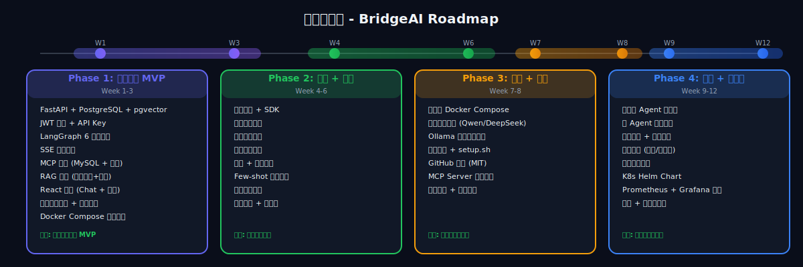

# BridgeAI - 迭代计划

> 版本：v0.3.0 | 起草日期：2026-04-01 | 更新：2026-04-01 | 状态：待确认
> v0.3 变更：上下文分析改为大模型输出，删除规则引擎相关任务

## 迭代总览

<p align="center">
  
</p>

---

## Phase 1：核心引擎 MVP（Week 1-3）

> 目标：能跑通"用户在 Web 上和 Agent 对话，Agent 调用 MCP 工具查数据库、查飞书"这条完整链路。

### Sprint 1.1（Week 1）：项目骨架 + 基础能力

| 任务 | 产出 | 验收标准 |
|------|------|---------|
| FastAPI 项目初始化 | 可运行的后端骨架 | `GET /health` 返回 200 |
| PostgreSQL + Milvus 初始化 | 数据库 Schema | 所有核心表创建成功 |
| Alembic 迁移配置 | 迁移脚本 | `alembic upgrade head` 成功 |
| 用户认证模块 | JWT 登录/注册 | 注册 → 登录 → 获取 Token → 访问受保护接口 |
| API Key 管理 | 创建/吊销 API Key | 通过 API Key 访问接口成功 |
| Docker Compose 开发环境 | 一键启动 | `docker compose up` 全部服务正常 |
| React 项目初始化 | 可运行的前端骨架 | 访问 localhost:5173 看到页面 |
| 登录/注册页面 | 前端认证流程 | 能登录进入主界面 |

### Sprint 1.2（Week 2）：Agent 引擎 + MCP

| 任务 | 产出 | 验收标准 |
|------|------|---------|
| LangGraph Agent 引擎 | Agent 核心代码（6阶段管线） | 能进行多轮对话 |
| Prompt 四层融合 + 分析指令 | PromptOptimizer + ContextParser | 回复末尾含 analysis JSON |
| 模型适配层 + 熔断降级 | 多 Provider + CircuitBreaker | 主模型失败自动切换 |
| 流式输出（SSE） | 后端 SSE + 前端流式渲染 | 打字机效果实时输出 |
| 对话历史 + 上下文持久化 | 消息 + intent/emotion 存 DB | 分析结果可查询统计 |
| MCP 网关核心 | MCP 协议实现 | 能注册和调用 MCP Server |
| MySQL MCP Server | 数据库查询工具 | AI 能用自然语言查询 MySQL |
| RAG 引擎核心 | 文档上传 → 检索 | 上传 PDF → 提问 → 返回相关内容 |
| Web Chat 页面 | 对话界面 | 能和 Agent 正常对话 |

### Sprint 1.3（Week 3）：更多 MCP + 管理页面

| 任务 | 产出 | 验收标准 |
|------|------|---------|
| 飞书 MCP Server | 飞书连接器 | AI 能发飞书消息、查飞书文档 |
| 通用 HTTP API MCP | 万能连接器 | 配置任意 REST API → AI 可调用 |
| Agent 管理页面 | CRUD 界面 | 创建/编辑/删除 Agent |
| Agent Prompt 编辑器 | System Prompt 编辑 | 修改 Prompt 后 Agent 行为变化 |
| MCP 连接器管理页面 | 添加/删除/测试连接器 | 添加 MySQL 连接 → 测试成功 |
| 知识库管理页面 | 上传文档/查看状态 | 上传 → 处理 → Ready |
| 仪表盘页面 | 使用统计概览 | 显示调用次数、Token 用量 |

### Phase 1 交付物

```
可运行的 BridgeAI MVP：
  ✅ Web 聊天界面
  ✅ Agent 对话（6阶段管线、多轮、流式、工具调用）
  ✅ 大模型一次性输出回答 + 上下文分析（情绪/意图/复杂度）
  ✅ 智能模型路由 + 熔断降级链
  ✅ 2 个 MCP 连接器（MySQL + 飞书）
  ✅ 知识库（上传文档 → RAG 检索）
  ✅ 管理后台（Agent/MCP/知识库/仪表盘）
  ✅ Docker Compose 一键启动
```

---

## Phase 2：行业插件 + 渠道接入（Week 4-6）

### Sprint 2.1（Week 4）：插件体系 + 电商插件

| 任务 | 产出 | 验收标准 |
|------|------|---------|
| 插件框架设计 | 基类 + 注册中心 + 加载器 | 能动态加载插件 |
| 插件 SDK | 开发者文档 + 示例 | 按文档能写出一个插件 |
| 跨境电商插件 v1 | Listing 优化 + 竞品分析 | 输入产品 → 生成优化 Listing |
| 插件市场页面 | 浏览/安装/配置 | 能安装和启用插件 |
| 企微机器人接入 | 企微渠道 | 在企微中和 Agent 对话 |

### Sprint 2.2（Week 5）：更多插件 + 钉钉

| 任务 | 产出 | 验收标准 |
|------|------|---------|
| 财税助手插件 v1 | 智能记账 + 政策问答 | 上传发票 → 生成凭证建议 |
| 法律助手插件 v1 | 合同审查 | 上传合同 → 标注风险条款 |
| 钉钉机器人接入 | 钉钉渠道 | 在钉钉中和 Agent 对话 |
| Few-shot 学习循环 | 评分 → 自动注入 Prompt | ≥4星对话出现在下次 Few-shot 中 |
| 审计日志系统 | 操作记录 + 查询页面 | 所有 MCP 调用有记录可查 |

### Sprint 2.3（Week 6）：计费 + 打磨

| 任务 | 产出 | 验收标准 |
|------|------|---------|
| 使用量统计 | 按租户统计 Token/调用量 | 仪表盘显示用量图表 |
| 免费额度控制 | 超额后限制调用 | 达到限额后提示升级 |
| 系统设置页面 | 模型选择/团队管理 | 能切换模型、邀请团队成员 |
| 多租户隔离 | 数据完全隔离 | 不同租户看不到彼此数据 |
| UI/UX 打磨 | 交互优化 | 流畅、好看、无明显 Bug |

### Phase 2 交付物

```
功能完整的 BridgeAI 平台：
  ✅ Phase 1 全部功能
  ✅ 3 个行业插件（电商/财税/法律）
  ✅ 3 个消息渠道（Web/企微/钉钉）
  ✅ 插件市场
  ✅ 审计日志
  ✅ 使用量统计 + 计费
  ✅ 多租户支持
```

---

## Phase 3：私有部署 + 开源推广（Week 7-8）

### Sprint 3.1（Week 7）：私有部署

| 任务 | 产出 | 验收标准 |
|------|------|---------|
| 生产级 Docker Compose | docker-compose.prod.yml | 生产环境一键部署 |
| 国产模型适配 | Qwen + DeepSeek 完整测试 | 不用 Claude 也能正常工作 |
| Ollama 本地模型支持 | 离线运行 | 断网也能对话 |
| 部署文档 | 详细部署指南 | 按文档操作能成功部署 |
| 环境检查脚本 | setup.sh | 自动检查依赖和配置 |

### Sprint 3.2（Week 8）：开源 + 推广

| 任务 | 产出 | 验收标准 |
|------|------|---------|
| MCP Server 独立仓库 | GitHub 开源 | 独立可用，README 完善 |
| BridgeAI 核心开源 | GitHub 仓库 | MIT License，可 Fork 可贡献 |
| 官网（Landing Page） | 产品介绍页 | 清晰展示价值和功能 |
| 技术博客 3 篇 | 掘金/知乎文章 | 发布并获得关注 |
| 安全加固 | 渗透测试 + 修复 | 无高危漏洞 |

### Phase 3 交付物

```
可商用的 BridgeAI 平台：
  ✅ Phase 1 + 2 全部功能
  ✅ Docker Compose 一键私有部署
  ✅ 多模型支持（Claude/Qwen/DeepSeek/Ollama）
  ✅ GitHub 开源仓库
  ✅ 独立 MCP Server 开源仓库
  ✅ 官网 + 技术博客
  ✅ 安全加固
```

---

## Phase 4：平台化 + 商业化（Week 9-12）

> 目标：从"能用的工具"升级为"可卖的产品"，具备商业化能力。

### Sprint 4.1（Week 9）：可视化 Agent 编排 + 飞书接入

| 任务 | 产出 | 验收标准 |
|------|------|---------|
| 可视化 Agent 编排器 | 拖拽式工作流设计器 | 拖拽节点创建 Agent 工作流，保存后可执行 |
| Agent 工作流引擎 | 支持条件分支/循环/并行 | 复杂工作流能正确执行 |
| 飞书机器人接入 | 飞书渠道 | 在飞书中和 Agent 对话 |
| 飞书 MCP Server 开源 | 独立 GitHub 仓库 | 独立可用，README 完善，可被 Star |

### Sprint 4.2（Week 10）：多 Agent 协作 + 教育插件

| 任务 | 产出 | 验收标准 |
|------|------|---------|
| 多 Agent 协作引擎 | 主 Agent 委派子 Agent 并汇总结果 | 复杂任务自动分解给多个专业 Agent |
| 子任务委派 UI | 前端展示 Agent 协作过程 | 能看到哪个 Agent 处理了什么 |
| 教育行业插件 | 智能出题 + 学情分析 | 输入知识点 → 自动生成试题 |
| 插件开发 SDK 文档 | 开发者文档 | 第三方按文档能开发插件 |

### Sprint 4.3（Week 11）：商业化基础

| 任务 | 产出 | 验收标准 |
|------|------|---------|
| 支付集成 | 微信/支付宝支付 | 用户能在线购买套餐 |
| 套餐管理系统 | 免费/专业/企业版切换 | 不同套餐对应不同额度和功能 |
| 用户管理后台 | 管理员视角的用户/租户管理 | 能查看所有租户、用量、收入 |
| 邀请注册系统 | 邀请码 + 推广链接 | 用户分享链接邀请新用户，可追踪 |
| Kubernetes Helm Chart | K8s 部署方案 | helm install 一键部署到 K8s |

### Sprint 4.4（Week 12）：产品打磨 + 上线

| 任务 | 产出 | 验收标准 |
|------|------|---------|
| 官网 Landing Page | 产品介绍 + 定价页 + 注册入口 | 设计精美，能转化用户 |
| SEO 优化 | 关键词优化 + 技术文章 5 篇 | 搜索"AI中台""MCP连接器"能找到 |
| 产品文档站 | VitePress 文档站 | 包含快速开始、API 文档、部署指南 |
| 性能压测 + 优化 | 压测报告 + 优化 | 50 并发稳定运行 |
| 安全审计 | 安全报告 | 无高危漏洞 |
| 监控告警 | Prometheus + Grafana | 核心指标可监控，异常自动告警 |
| 正式上线 | SaaS 版上线 | 用户可注册、试用、付费 |

### Phase 4 交付物

```
可商业运营的 BridgeAI 平台：
  ✅ Phase 1 + 2 + 3 全部功能
  ✅ 可视化 Agent 编排器（拖拽式）
  ✅ 多 Agent 协作
  ✅ 4 个渠道（Web/企微/钉钉/飞书）
  ✅ 4 个行业插件（电商/财税/法律/教育）
  ✅ 支付系统 + 套餐管理
  ✅ 官网 + 产品文档
  ✅ K8s 部署方案
  ✅ 监控告警体系
  ✅ 正式上线运营
```

---

## 后续规划（Phase 5+）

| 功能 | 优先级 | 预计时间 |
|------|--------|---------|
| 语音输入/输出 | P3 | Phase 5 |
| 移动端 App（微信小程序） | P3 | Phase 5 |
| 国际化（英文版） | P3 | Phase 5 |
| 开放 API 市场（第三方插件交易） | P3 | Phase 6 |

---

## 质量标准

### 代码规范

- Python: PEP 8 + Type Hints + Black + Ruff
- TypeScript: ESLint + Prettier
- 提交: Conventional Commits (feat/fix/refactor/docs/test)
- Review: 关键模块写单元测试，覆盖率 > 60%

### 性能目标

| 指标 | 目标 |
|------|------|
| API 响应时间（非 LLM） | < 200ms (P95) |
| 首 Token 延迟 | < 2s |
| 流式输出吞吐 | > 30 token/s |
| RAG 检索延迟 | < 500ms |
| 并发会话数 | > 50 (单机) |
| 文档向量化速度 | > 10 页/秒 |

### 可用性目标

| 指标 | 目标 |
|------|------|
| SaaS 可用性 | 99.5% |
| 平均故障恢复 | < 30 分钟 |
| 数据备份 | 每日自动备份 |
