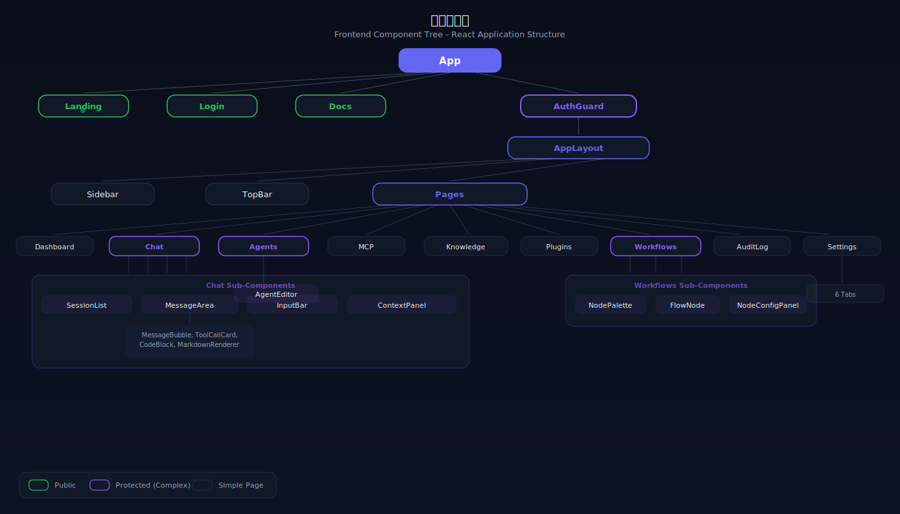
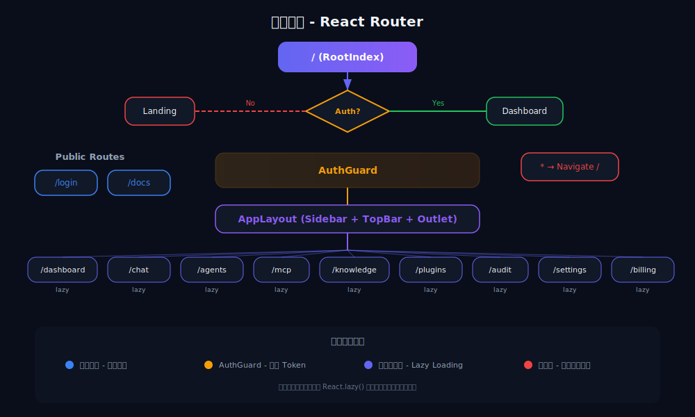
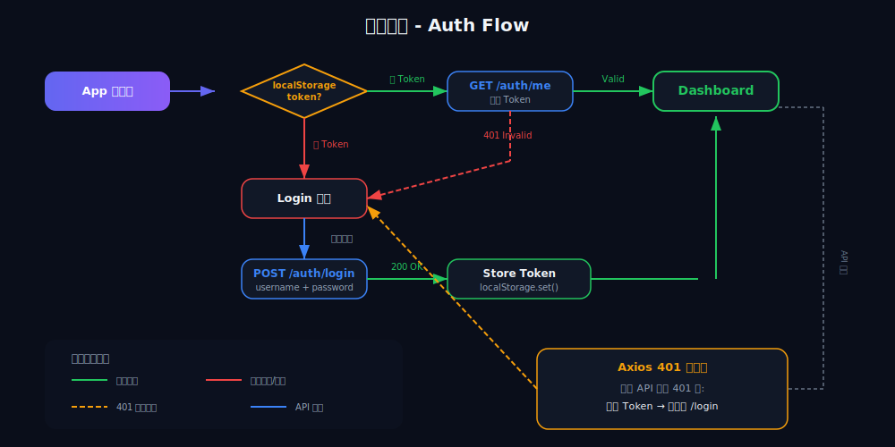
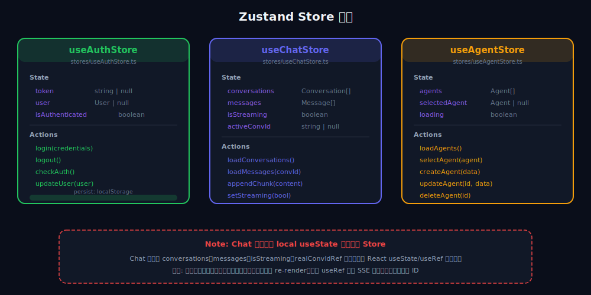
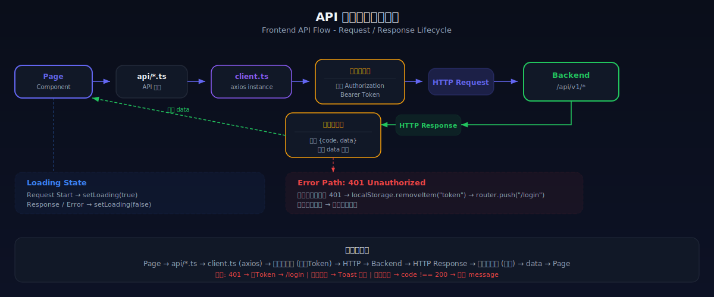
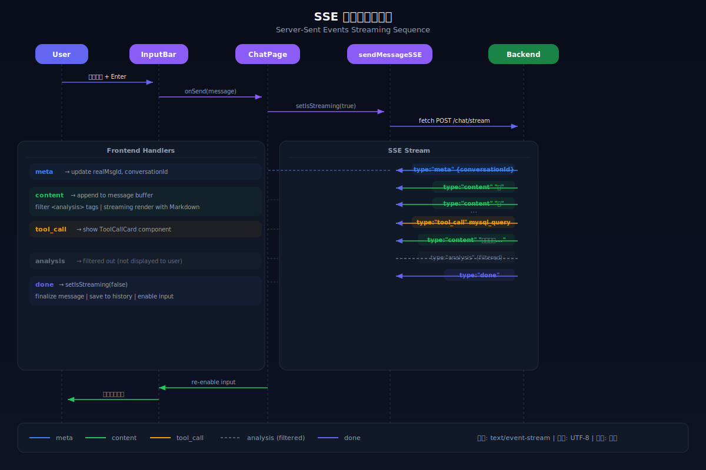
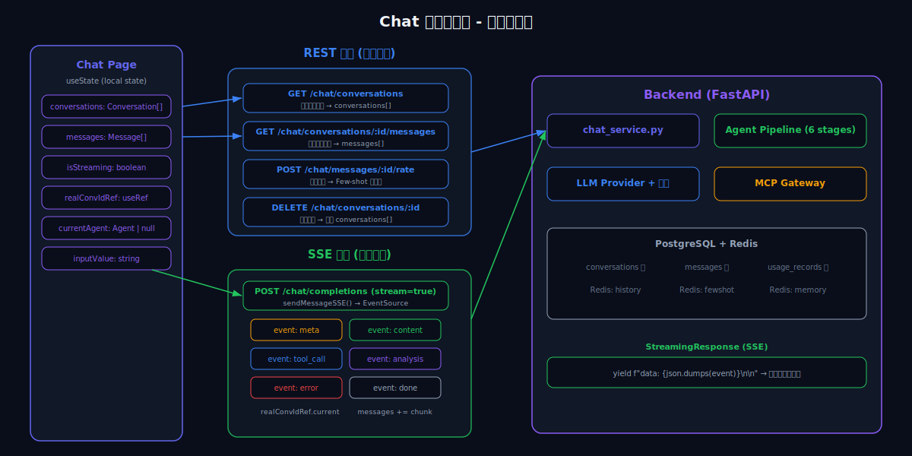

# BridgeAI - 前端设计方案

> 版本：v0.3.0 | 起草日期：2026-04-01 | 状态：待确认

## 一、设计原则

| 原则 | 说明 |
|------|------|
| **深色主题优先** | 科技感强，AI 产品标配，长时间使用不刺眼 |
| **玻璃拟态风格** | 毛玻璃背景 + 微透明卡片 + 柔和光影，现代高级感 |
| **动效克制** | 关键交互有动效（消息出现、页面切换），不做花哨动画 |
| **信息密度适中** | 管理后台信息密度高，对话界面留白多 |
| **移动端适配** | 响应式布局，手机上也能用（但不作为首要目标） |

## 二、技术栈

| 技术 | 版本 | 用途 |
|------|------|------|
| **React** | 18+ | UI 框架 |
| **TypeScript** | 5+ | 类型安全 |
| **Vite** | 6+ | 构建工具 |
| **Ant Design** | 5+ | 基础组件库（表格、表单、弹窗等） |
| **Tailwind CSS** | 4+ | 原子化样式，快速自定义 |
| **Zustand** | 5+ | 状态管理 |
| **React Router** | 7+ | 路由 |
| **Axios** | 1+ | HTTP 请求 |
| **ahooks** | 3+ | React Hooks 工具集（防抖、轮询等） |
| **react-markdown** | 9+ | Markdown 渲染（对话内容） |
| **react-syntax-highlighter** | 15+ | 代码高亮 |
| **recharts** | 2+ | 图表（仪表盘） |
| **framer-motion** | 11+ | 动效（页面切换、消息出现） |

### 为什么 Ant Design + Tailwind 而不是纯 Tailwind？

```
纯 Tailwind：
  - 每个组件从头写，开发慢
  - 表格、表单、弹窗、下拉菜单都要自己实现

Ant Design + Tailwind：
  - Ant Design 负责复杂组件（Table、Form、Modal、Select、Tree）
  - Tailwind 负责布局和自定义样式（间距、颜色、毛玻璃效果）
  - 开发速度快 3-5 倍
  - Ant Design 5 支持 CSS-in-JS，可以深度自定义主题
```

## 三、主题配色

```typescript
// 深色科技主题
const theme = {
  // 背景色系
  bg: {
    primary: '#0a0e1a',      // 主背景（深蓝黑）
    secondary: '#111827',     // 卡片背景
    tertiary: '#1a2332',      // 悬浮/选中态
    glass: 'rgba(17, 24, 39, 0.7)',  // 毛玻璃
  },
  // 品牌色
  brand: {
    primary: '#6366f1',       // 主色（靛蓝紫）
    secondary: '#8b5cf6',     // 辅色（紫色）
    gradient: 'linear-gradient(135deg, #6366f1, #8b5cf6)',  // 渐变
  },
  // 功能色
  status: {
    success: '#22c55e',       // 绿
    warning: '#f59e0b',       // 橙
    error: '#ef4444',         // 红
    info: '#3b82f6',          // 蓝
  },
  // 文字色
  text: {
    primary: '#f1f5f9',       // 主文字
    secondary: '#94a3b8',     // 次级文字
    muted: '#64748b',         // 弱化文字
  },
  // 边框
  border: {
    default: 'rgba(148, 163, 184, 0.1)',
    hover: 'rgba(148, 163, 184, 0.2)',
  },
}
```

## 四、组件树

<p align="center">
  
</p>

## 四-b、路由架构

<p align="center">
  
</p>

## 四-c、认证流程

<p align="center">
  
</p>

## 四、页面布局

### 4.1 整体布局

```
┌──────────────────────────────────────────────────────────┐
│  顶栏 (64px)                                              │
│  Logo + BridgeAI    [搜索]    [通知] [头像/租户切换]       │
├────────┬─────────────────────────────────────────────────┤
│ 侧边栏  │                                                │
│ (240px) │              主内容区                            │
│         │                                                │
│ 💬 对话  │                                                │
│ 🤖 Agent│                                                │
│ 🔗 连接器│                                                │
│ 📚 知识库│                                                │
│ 🧩 插件  │                                                │
│ 📊 仪表盘│                                                │
│ 📋 审计  │                                                │
│ ⚙️ 设置  │                                                │
│         │                                                │
│─────────│                                                │
│ 用量/额度│                                                │
│ ████░░  │                                                │
│ 1200/5k │                                                │
└────────┴─────────────────────────────────────────────────┘
```

### 4.2 侧边栏设计

```
- 宽度 240px，可收起为 72px（图标模式）
- 毛玻璃背景 + 左侧高亮条（选中态）
- 底部显示当前租户使用量进度条
- 收起时只显示图标 + tooltip
```

## 五、核心页面设计

### 5.1 对话页面（最重要，用户最常用）

```
┌────────┬──────────────────────────────────┬─────────────┐
│ 侧边栏  │           对话主区                │  右侧面板    │
│        │                                  │ (可收起)     │
│ 会话列表 │  ┌────────────────────────────┐  │             │
│        │  │ 🤖 数据分析 Agent            │  │ Agent 信息  │
│ > 今天  │  │    我是数据分析助手，可以     │  │ 模型: Claude │
│  会话1  │  │    帮你查询和分析数据库数据。 │  │ 工具: 3个   │
│  会话2  │  │                              │  │ 知识库: 1个  │
│ > 昨天  │  ├────────────────────────────┤  │             │
│  会话3  │  │ 👤 查一下上个月销售额最高    │  │ 工具调用记录 │
│        │  │    的5个产品                  │  │ ┌─────────┐ │
│        │  ├────────────────────────────┤  │ │mysql_q..│ │
│ [新对话] │  │ 🤖 根据数据库查询结果...     │  │ │✅ 320ms  │ │
│        │  │                              │  │ └─────────┘ │
│        │  │  📊 产品销售排名              │  │             │
│        │  │  | 排名 | 产品  | 销售额  |   │  │ 上下文分析  │
│        │  │  | 1    | A产品 | ¥52万   |   │  │ 意图: 数据查询│
│        │  │  | 2    | B产品 | ¥48万   |   │  │ 情绪: neutral│
│        │  │  | ...  | ...   | ...     |   │  │ 复杂度: low  │
│        │  │                              │  │             │
│        │  │  ⭐⭐⭐⭐⭐ [评分]            │  │             │
│        │  └────────────────────────────┘  │             │
│        │                                  │             │
│        │  ┌────────────────────────────┐  │             │
│        │  │ 📎 [输入消息...]    [发送▶] │  │             │
│        │  └────────────────────────────┘  │             │
└────────┴──────────────────────────────────┴─────────────┘
```

**对话页面要点：**

| 特性 | 说明 |
|------|------|
| **三栏布局** | 会话列表 + 对话主区 + 右侧面板（可收起） |
| **流式打字效果** | SSE 流式输出，逐字显示，有光标闪烁 |
| **Markdown 渲染** | 支持表格、代码块（带语法高亮）、列表、链接 |
| **工具调用可视化** | 展示 MCP 工具调用过程：工具名 → 加载中 → 结果 |
| **评分组件** | 每条 AI 回复下方有 1-5 星评分（用于 Few-shot 学习） |
| **消息动效** | 新消息从底部淡入，AI 回复有轻微展开动画 |
| **代码块** | 一键复制按钮，语言标签，深色代码主题 |
| **文件上传** | 拖拽上传文件（PDF/图片），用于知识库或对话 |
| **Agent 切换** | 对话区顶部可快速切换不同 Agent |
| **右侧面板** | 显示当前 Agent 信息、工具调用记录、上下文分析结果 |

### 5.2 Agent 管理页面

```
┌──────────────────────────────────────────────────────────┐
│  Agent 管理                              [+ 创建 Agent]  │
├──────────────────────────────────────────────────────────┤
│                                                          │
│  ┌─────────────┐  ┌─────────────┐  ┌─────────────┐     │
│  │ 🤖           │  │ 📊           │  │ 💼           │     │
│  │ 智能客服      │  │ 数据分析师    │  │ 办公助手      │     │
│  │              │  │              │  │              │     │
│  │ Claude Sonnet│  │ DeepSeek     │  │ Qwen Plus    │     │
│  │ 工具: 2      │  │ 工具: 3      │  │ 工具: 4      │     │
│  │ 知识库: 1    │  │ 知识库: 0    │  │ 知识库: 2    │     │
│  │              │  │              │  │              │     │
│  │ ● 运行中     │  │ ● 运行中     │  │ ○ 已停用     │     │
│  │ [编辑] [对话] │  │ [编辑] [对话] │  │ [编辑] [启用] │     │
│  └─────────────┘  └─────────────┘  └─────────────┘     │
│                                                          │
└──────────────────────────────────────────────────────────┘
```

**Agent 编辑页面（抽屉/弹窗）：**

```
┌──────────────────────────────────────────┐
│  编辑 Agent: 智能客服                [保存] │
├──────────────────────────────────────────┤
│                                          │
│  基本信息                                 │
│  名称:    [智能客服                    ]  │
│  描述:    [基于知识库的智能客服机器人    ]  │
│  图标:    [🤖 选择]                       │
│                                          │
│  模型配置                                 │
│  提供商:  [Claude      ▼]                │
│  模型:    [claude-sonnet-4-6 ▼]          │
│  温度:    [0.7 ────●────── ]             │
│                                          │
│  System Prompt                           │
│  ┌──────────────────────────────────┐    │
│  │ 你是一个专业的客服助手。         │    │
│  │ 请根据知识库中的内容回答用户问题。│    │
│  │ 如果不确定，请告知用户联系人工。  │    │
│  │                                  │    │
│  └──────────────────────────────────┘    │
│                                          │
│  绑定工具  [+ 添加]                       │
│  ☑ feishu_send_message                   │
│  ☑ mysql_query                           │
│  ☐ http_post                             │
│                                          │
│  绑定知识库  [+ 添加]                     │
│  ☑ 产品FAQ知识库                          │
│                                          │
│  高级配置                                 │
│  ▶ 模型路由覆盖                           │
│  ▶ 子 Agent 管理                          │
│  ▶ 降级链配置                             │
│                                          │
└──────────────────────────────────────────┘
```

### 5.3 MCP 连接器页面

```
┌──────────────────────────────────────────────────────────┐
│  MCP 连接器                            [+ 添加连接器]    │
├──────────────────────────────────────────────────────────┤
│                                                          │
│  已连接 (3)                                               │
│  ┌────────────────────────────────────────────────────┐  │
│  │ 🗄️ MySQL 生产库              ● 健康    [测试] [编辑]│  │
│  │   host: 192.168.1.100:3306    工具: 4个              │  │
│  │   上次检查: 2分钟前            调用: 1,234次          │  │
│  ├────────────────────────────────────────────────────┤  │
│  │ 📘 飞书工作空间               ● 健康    [测试] [编辑]│  │
│  │   app_id: cli_xxx             工具: 7个              │  │
│  │   上次检查: 5分钟前            调用: 567次            │  │
│  ├────────────────────────────────────────────────────┤  │
│  │ 🌐 内部API网关                ⚠ 超时    [测试] [编辑]│  │
│  │   url: https://api.xxx.com    工具: 3个              │  │
│  │   上次检查: 1分钟前            调用: 89次             │  │
│  └────────────────────────────────────────────────────┘  │
│                                                          │
│  连接器市场                                               │
│  ┌──────────┐  ┌──────────┐  ┌──────────┐  ┌──────────┐│
│  │ 📘 飞书   │  │ 💬 钉钉  │  │ 🗄️ MySQL │  │ 🌐 HTTP  ││
│  │ 官方      │  │ 官方     │  │ 官方      │  │ 官方     ││
│  │ ⭐4.8     │  │ ⭐4.5    │  │ ⭐4.9     │  │ ⭐4.7    ││
│  │ [已安装]  │  │ [安装]   │  │ [已安装]  │  │ [已安装] ││
│  └──────────┘  └──────────┘  └──────────┘  └──────────┘│
│                                                          │
└──────────────────────────────────────────────────────────┘
```

### 5.4 知识库页面

```
┌──────────────────────────────────────────────────────────┐
│  知识库管理                              [+ 创建知识库]   │
├──────────────────────────────────────────────────────────┤
│                                                          │
│  ┌────────────────────────────────────────────────────┐  │
│  │ 📚 产品FAQ知识库                                    │  │
│  │                                                     │  │
│  │   文档: 12个    向量块: 2,456个    状态: ✅ 就绪     │  │
│  │   Embedding: bge-m3                 │  │
│  │   绑定 Agent: 智能客服、办公助手                     │  │
│  │                                                     │  │
│  │   最近文档:                                          │  │
│  │   📄 产品手册v3.pdf         ✅ 已索引   2小时前      │  │
│  │   📄 常见问题.docx          ✅ 已索引   1天前        │  │
│  │   📄 退换货政策.md          🔄 处理中   刚刚        │  │
│  │                                                     │  │
│  │   [上传文档]  [测试检索]  [设置]                     │  │
│  └────────────────────────────────────────────────────┘  │
│                                                          │
│  ┌────────────────────────────────────────────────────┐  │
│  │ 📚 内部运维文档                                     │  │
│  │   文档: 5个    向量块: 890个     状态: ✅ 就绪       │  │
│  │   [上传文档]  [测试检索]  [设置]                     │  │
│  └────────────────────────────────────────────────────┘  │
│                                                          │
└──────────────────────────────────────────────────────────┘
```

**测试检索弹窗：**

```
┌──────────────────────────────────────────┐
│  测试检索: 产品FAQ知识库                   │
├──────────────────────────────────────────┤
│                                          │
│  输入问题:                                │
│  [退换货流程是什么？                   ]  │
│                                [检索]    │
│                                          │
│  检索结果 (Top 3):                        │
│                                          │
│  #1  相似度: 0.92                         │
│  ┌──────────────────────────────────┐    │
│  │ 退换货流程如下：                  │    │
│  │ 1. 在订单页面点击"申请退换"      │    │
│  │ 2. 选择原因并上传照片...          │    │
│  │ 来源: 退换货政策.md (第3段)       │    │
│  └──────────────────────────────────┘    │
│                                          │
│  #2  相似度: 0.85                         │
│  ┌──────────────────────────────────┐    │
│  │ 退款将在3-5个工作日内...          │    │
│  └──────────────────────────────────┘    │
│                                          │
└──────────────────────────────────────────┘
```

### 5.5 仪表盘页面

```
┌──────────────────────────────────────────────────────────┐
│  仪表盘                                    本月 ▼        │
├──────────────────────────────────────────────────────────┤
│                                                          │
│  ┌──────────┐  ┌──────────┐  ┌──────────┐  ┌──────────┐│
│  │ 总对话数  │  │ Token用量 │  │ 平均响应  │  │ 满意度   ││
│  │  1,234   │  │  2.4M    │  │  1.2s    │  │  4.6⭐   ││
│  │ ↑12%     │  │ ↑8%      │  │ ↓15%     │  │ ↑0.2     ││
│  └──────────┘  └──────────┘  └──────────┘  └──────────┘│
│                                                          │
│  ┌──────────────────────────┐  ┌────────────────────────┐│
│  │  对话量趋势 (折线图)      │  │  意图分布 (饼图)       ││
│  │  ╱╲    ╱╲               │  │   ● 数据查询  35%      ││
│  │ ╱  ╲  ╱  ╲  ╱           │  │   ● 客服咨询  28%      ││
│  │╱    ╲╱    ╲╱             │  │   ● 文档处理  20%      ││
│  │                          │  │   ● 其他     17%       ││
│  └──────────────────────────┘  └────────────────────────┘│
│                                                          │
│  ┌──────────────────────────┐  ┌────────────────────────┐│
│  │  模型使用分布 (柱状图)    │  │  情绪分布 (环形图)     ││
│  │  █████ Claude  45%       │  │    positive  62%       ││
│  │  ████  DeepSeek 30%      │  │    neutral   28%       ││
│  │  ███   Qwen    20%       │  │    negative   6%       ││
│  │  █     Ollama   5%       │  │    urgent     4%       ││
│  └──────────────────────────┘  └────────────────────────┘│
│                                                          │
│  最近对话                                                 │
│  ┌────────────────────────────────────────────────────┐  │
│  │ 时间     │ 用户    │ Agent   │ 意图     │ 评分    │  │
│  │ 10:23   │ 张三    │ 客服    │ 退换货   │ ⭐⭐⭐⭐ │  │
│  │ 10:15   │ 李四    │ 数据    │ 销售查询 │ ⭐⭐⭐⭐⭐│  │
│  │ 10:02   │ 王五    │ 客服    │ 产品咨询 │ -      │  │
│  └────────────────────────────────────────────────────┘  │
│                                                          │
└──────────────────────────────────────────────────────────┘
```

### 5.6 系统设置页面

```
┌──────────────────────────────────────────────────────────┐
│  系统设置                                                 │
├──────────┬───────────────────────────────────────────────┤
│          │                                               │
│ 模型配置  │  模型提供商                                    │
│ 团队管理  │                                               │
│ API Key  │  ┌─────────────────────────────────────────┐  │
│ 渠道接入  │  │ Anthropic Claude            ● 已连接    │  │
│ 安全设置  │  │ API Key: sk-ant-***...vMlDJ             │  │
│ 计费     │  │ 模型: claude-opus-4-6, claude-sonnet-4-6 │  │
│          │  │                         [编辑] [测试]    │  │
│          │  ├─────────────────────────────────────────┤  │
│          │  │ DeepSeek                   ● 已连接      │  │
│          │  │ API Key: sk-***...                       │  │
│          │  │                         [编辑] [测试]    │  │
│          │  ├─────────────────────────────────────────┤  │
│          │  │ 通义千问 Qwen              ○ 未配置      │  │
│          │  │                              [配置]      │  │
│          │  ├─────────────────────────────────────────┤  │
│          │  │ Ollama (本地)              ● 已连接      │  │
│          │  │ 地址: http://localhost:11434             │  │
│          │  │                         [编辑] [测试]    │  │
│          │  └─────────────────────────────────────────┘  │
│          │                                               │
│          │  降级链配置                                     │
│          │  [Claude] → [DeepSeek] → [Qwen] → [Ollama]   │
│          │  拖拽调整顺序                                  │
│          │                                               │
└──────────┴───────────────────────────────────────────────┘
```

### 5.7 登录页面

```
┌──────────────────────────────────────────────────────────┐
│                                                          │
│          ░░░░░░░░░░░░░░░░░░░░░ (动态粒子背景)            │
│          ░░░░░░░░░░░░░░░░░░░░░                           │
│                                                          │
│              ┌──────────────────────┐                    │
│              │                      │                    │
│              │    🌉 BridgeAI       │                    │
│              │    企业 AI 中台       │                    │
│              │                      │                    │
│              │  邮箱/手机号          │                    │
│              │  [                 ]  │                    │
│              │                      │                    │
│              │  密码                 │                    │
│              │  [                 ]  │                    │
│              │                      │                    │
│              │  [     登 录      ]   │                    │
│              │                      │                    │
│              │  ── 或 ──            │                    │
│              │  [微信扫码登录]       │                    │
│              │                      │                    │
│              │  没有账号？ 注册      │                    │
│              │                      │                    │
│              └──────────────────────┘                    │
│              (毛玻璃卡片 + 微光边框)                       │
│                                                          │
└──────────────────────────────────────────────────────────┘
```

## 五-b、状态管理

<p align="center">
  
</p>

## 五-c、API 请求流

<p align="center">
  
</p>

## 六、前端目录结构

```
frontend/
├── public/
│   ├── favicon.svg
│   └── logo.svg
│
├── src/
│   ├── main.tsx                  # 入口
│   ├── App.tsx                   # 根组件
│   ├── routes.tsx                # 路由配置
│   │
│   ├── api/                     # API 层
│   │   ├── client.ts            # Axios 实例（拦截器、Token 注入）
│   │   ├── auth.ts              # 登录/注册/刷新Token
│   │   ├── chat.ts              # 对话（含 SSE 流式）
│   │   ├── agents.ts            # Agent CRUD
│   │   ├── mcp.ts               # MCP 连接器
│   │   ├── knowledge.ts         # 知识库
│   │   ├── plugins.ts           # 插件市场
│   │   └── system.ts            # 系统设置/统计
│   │
│   ├── stores/                  # Zustand 状态管理
│   │   ├── useAuthStore.ts      # 认证状态
│   │   ├── useChatStore.ts      # 对话状态（会话列表、消息）
│   │   ├── useAgentStore.ts     # Agent 状态
│   │   └── useSettingStore.ts   # 全局设置
│   │
│   ├── hooks/                   # 自定义 Hooks
│   │   ├── useSSE.ts            # SSE 流式响应处理
│   │   ├── useAuth.ts           # 认证逻辑
│   │   └── useTheme.ts          # 主题切换
│   │
│   ├── pages/                   # 页面组件
│   │   ├── Login/
│   │   │   └── index.tsx        # 登录/注册页
│   │   ├── Dashboard/
│   │   │   ├── index.tsx        # 仪表盘
│   │   │   └── StatCard.tsx     # 统计卡片
│   │   ├── Chat/
│   │   │   ├── index.tsx        # 对话主页面（三栏布局）
│   │   │   ├── SessionList.tsx  # 左侧会话列表
│   │   │   ├── MessageArea.tsx  # 中间消息区
│   │   │   ├── MessageBubble.tsx # 消息气泡
│   │   │   ├── InputBar.tsx     # 底部输入框
│   │   │   ├── ToolCallCard.tsx # 工具调用展示卡片
│   │   │   ├── RatingStars.tsx  # 评分组件
│   │   │   └── ContextPanel.tsx # 右侧上下文面板
│   │   ├── Agents/
│   │   │   ├── index.tsx        # Agent 列表（卡片网格）
│   │   │   └── AgentEditor.tsx  # Agent 编辑（抽屉）
│   │   ├── MCP/
│   │   │   ├── index.tsx        # 连接器管理
│   │   │   ├── ConnectorCard.tsx # 连接器卡片
│   │   │   └── Marketplace.tsx  # 连接器市场
│   │   ├── Knowledge/
│   │   │   ├── index.tsx        # 知识库列表
│   │   │   ├── DocumentList.tsx # 文档列表
│   │   │   └── SearchTest.tsx   # 检索测试弹窗
│   │   ├── Plugins/
│   │   │   └── index.tsx        # 插件市场
│   │   ├── AuditLog/
│   │   │   └── index.tsx        # 审计日志表格
│   │   └── Settings/
│   │       ├── index.tsx        # 设置主页（左侧Tab切换）
│   │       ├── ModelConfig.tsx  # 模型配置
│   │       ├── TeamManage.tsx   # 团队管理
│   │       ├── ApiKeys.tsx      # API Key 管理
│   │       └── ChannelConfig.tsx # 渠道接入配置
│   │
│   ├── components/              # 通用组件
│   │   ├── Layout/
│   │   │   ├── AppLayout.tsx    # 整体布局（侧边栏+顶栏+内容区）
│   │   │   ├── Sidebar.tsx      # 侧边栏
│   │   │   └── TopBar.tsx       # 顶栏
│   │   ├── MarkdownRenderer.tsx # Markdown 渲染（含代码高亮）
│   │   ├── FileUploader.tsx     # 文件上传（拖拽）
│   │   ├── GlassCard.tsx        # 毛玻璃卡片组件
│   │   ├── StatusBadge.tsx      # 状态徽章（健康/异常/离线）
│   │   ├── LoadingDots.tsx      # AI 思考中动画（三个跳动的点）
│   │   └── EmptyState.tsx       # 空状态占位
│   │
│   ├── styles/
│   │   ├── globals.css          # 全局样式（Tailwind 指令）
│   │   ├── antd-override.css    # Ant Design 深色主题覆盖
│   │   └── animations.css       # 动画定义
│   │
│   ├── utils/
│   │   ├── format.ts            # 格式化工具（时间、数字、Token数）
│   │   ├── storage.ts           # localStorage 封装
│   │   └── constants.ts         # 常量定义
│   │
│   └── types/                   # TypeScript 类型定义
│       ├── agent.ts
│       ├── chat.ts
│       ├── mcp.ts
│       └── common.ts
│
├── index.html
├── vite.config.ts
├── tsconfig.json
├── tailwind.config.ts
├── package.json
└── Dockerfile
```

## 七、关键交互细节

<p align="center">
  
</p>

<p align="center">
  
</p>

### 7.1 流式对话（SSE）

```typescript
// useSSE.ts - 核心 Hook
function useSSE() {
  const appendMessage = useChatStore(s => s.appendMessage)

  const sendMessage = async (content: string, agentId: string) => {
    const response = await fetch('/api/v1/chat/completions', {
      method: 'POST',
      headers: { 'Content-Type': 'application/json', 'Authorization': `Bearer ${token}` },
      body: JSON.stringify({ message: content, agent_id: agentId, stream: true })
    })

    const reader = response.body!.getReader()
    const decoder = new TextDecoder()
    let buffer = ''

    while (true) {
      const { done, value } = await reader.read()
      if (done) break

      buffer += decoder.decode(value, { stream: true })
      const lines = buffer.split('\n')
      buffer = lines.pop() || ''

      for (const line of lines) {
        if (line.startsWith('data: ')) {
          const data = JSON.parse(line.slice(6))
          if (data.type === 'content') {
            appendMessage(data.content)   // 逐字追加
          } else if (data.type === 'tool_call') {
            showToolCall(data)            // 展示工具调用
          } else if (data.type === 'analysis') {
            updateAnalysis(data)          // 更新右侧分析面板
          }
        }
      }
    }
  }

  return { sendMessage }
}
```

### 7.2 工具调用展示

```
用户发送消息后，如果 Agent 调用了工具：

  ┌─ 🔧 调用工具: mysql_query ────────────────┐
  │  SQL: SELECT product_name, SUM(amount)     │
  │       FROM orders                           │
  │       GROUP BY product_name                 │
  │       ORDER BY SUM(amount) DESC LIMIT 5    │
  │                                             │
  │  ⏱ 320ms  ✅ 成功  返回 5 行               │
  └─────────────────────────────────────────────┘

  展开可查看完整返回结果。
  折叠状态只显示：🔧 mysql_query ✅ 320ms
```

### 7.3 消息气泡样式

```
用户消息：
  - 靠右对齐
  - 品牌渐变色背景（靛蓝→紫）
  - 白色文字
  - 圆角 16px（右上角 4px）

AI 消息：
  - 靠左对齐
  - 深灰透明背景（#1a2332 80%透明度）
  - 浅色文字
  - 圆角 16px（左上角 4px）
  - 支持 Markdown 渲染
  - 底部：复制按钮 + 评分星星
```

## 八、响应式断点

```
Desktop:  > 1280px  （三栏布局，完整功能）
Tablet:   768-1280px （两栏，右侧面板收起）
Mobile:   < 768px   （单栏，底部Tab导航）
```

## 九、参考设计风格

以下产品的设计风格值得参考（非抄袭，取其精华）：

| 产品 | 参考点 |
|------|--------|
| **ChatGPT** | 对话界面布局、消息流式体验 |
| **Dify** | Agent 编辑器、工作流编排界面 |
| **Linear** | 深色主题、信息密度、交互细节 |
| **Vercel Dashboard** | 卡片设计、状态展示、简洁感 |
| **Raycast** | 毛玻璃效果、动效品质 |
