# 架构设计文档

## 总体架构

BridgeAI 采用分层架构设计，后端基于 FastAPI 构建，前端使用 React + TypeScript。

<p align="center">
  
</p>

<p align="center">
  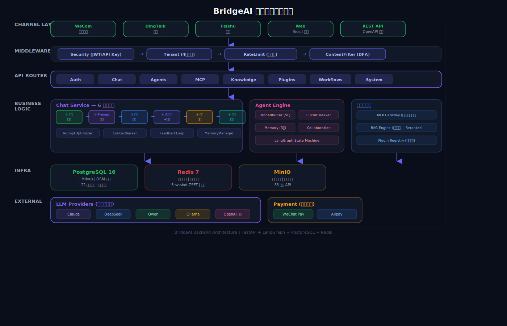
</p>

## Agent 引擎 -- LangGraph 6 阶段管线

对话处理的核心是基于 LangGraph 状态机实现的 6 阶段管线。

<p align="center">
  
</p>

### 管线流程

<p align="center">
  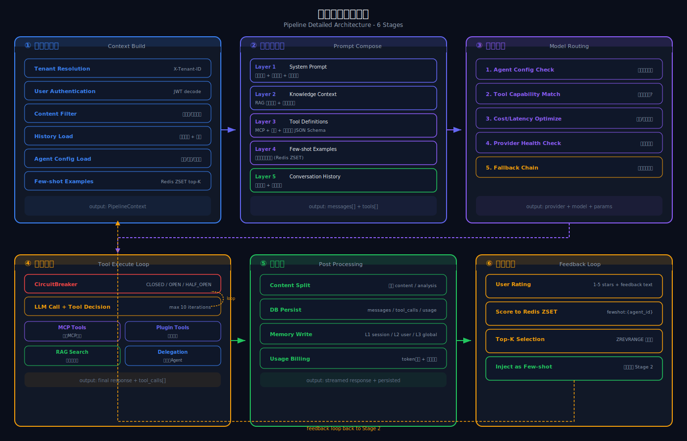
</p>

### 状态定义

管线中的状态通过 `PipelineState` (TypedDict) 在各阶段之间传递：

- **输入状态** -- `user_message`, `history_messages`, `agent_config`, `knowledge_base_id` 等
- **Stage 1 输出** -- `intent`, `intent_confidence`
- **Stage 2 输出** -- `rag_context`, `optimized_messages`
- **Stage 3 输出** -- `available_tools`, `mcp_connector_ids`
- **Stage 4 输出** -- `provider_name`, `model_id`, `temperature`, `max_tokens`

### 多Agent协作

<p align="center">
  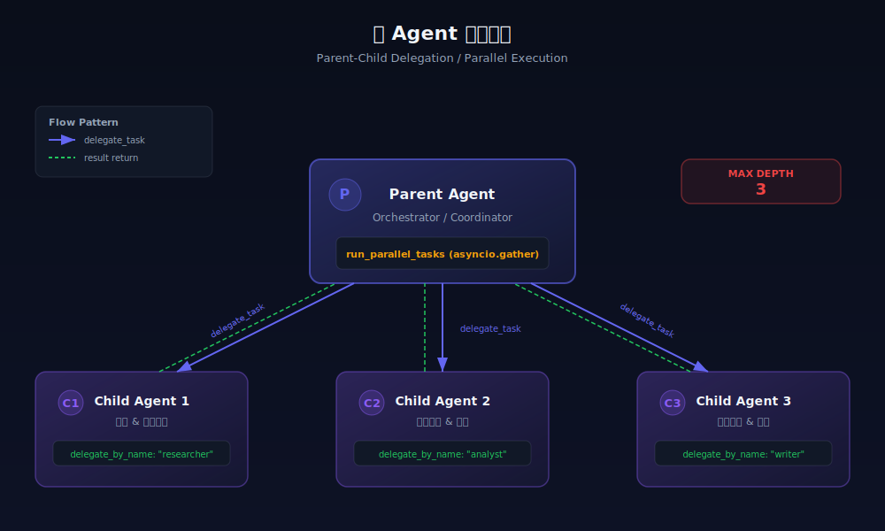
</p>

### 记忆管理

<p align="center">
  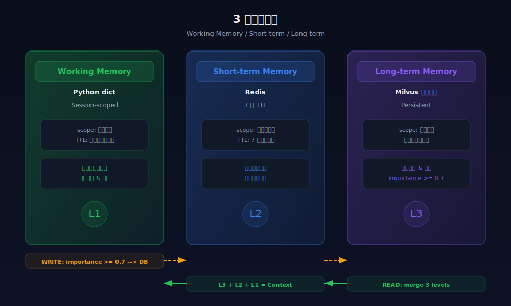
</p>

### 熔断降级

`CircuitBreaker` 组件保障模型调用可用性：

- 单个模型连续失败 N 次后自动熔断
- 熔断后自动切换降级链中的下一个模型
- 熔断冷却时间后自动恢复为半开状态
- 所有模型都不可用时抛出明确异常

## MCP 网关

MCP (Model Context Protocol) 网关负责管理外部工具连接。

<p align="center">
  
</p>

### 连接器基类

所有 MCP 连接器实现 `MCPConnector` 抽象基类：

```python
class MCPConnector(ABC):
    async def connect(self, config: dict) -> None
    async def disconnect(self) -> None
    async def list_tools(self) -> list[ToolDefinition]
    async def execute_tool(self, tool_name: str, arguments: dict) -> ToolResult
    async def health_check(self) -> bool
```

## RAG 引擎

知识库检索增强生成 (RAG) 引擎处理文档的全生命周期。

### 处理流程

<p align="center">
  
</p>

<p align="center">
  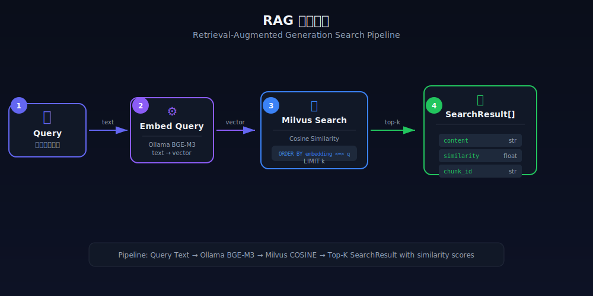
</p>

### 组件

- **Parsers** -- 解析器工厂模式，根据文件扩展名自动选择
- **Chunker** -- 可配置的文本切分器，支持 chunk_size 和 overlap
- **Embeddings** -- 支持 API 调用和本地 TF-IDF 两种模式
- **Engine** -- RAG 编排器，协调解析 -> 切分 -> 向量化 -> 存储 -> 检索

## 插件系统

行业插件以标准化接口扩展 Agent 能力。

<p align="center">
  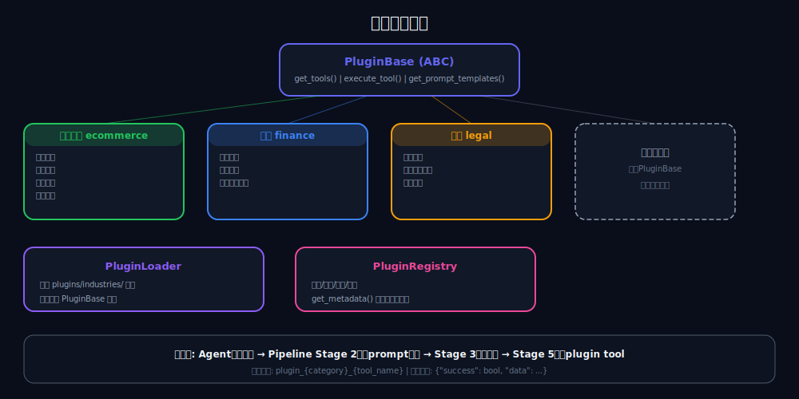
</p>

### 插件接口

```python
class PluginBase(ABC):
    name: str
    display_name: str
    category: str  # ecommerce / finance / legal

    def get_tools(self) -> list[PluginTool]
    async def execute_tool(self, tool_name: str, arguments: dict) -> dict
    def get_prompt_templates(self) -> list[PluginPromptTemplate]
    def get_system_prompt_extension(self) -> str
```

### 插件发现

- `PluginLoader` 扫描 `plugins/industries/` 目录
- 自动发现并注册所有 `PluginBase` 子类
- 支持运行时启用/禁用

## 渠道接入

统一的渠道管理器连接 IM 平台与 Agent 管线。

<p align="center">
  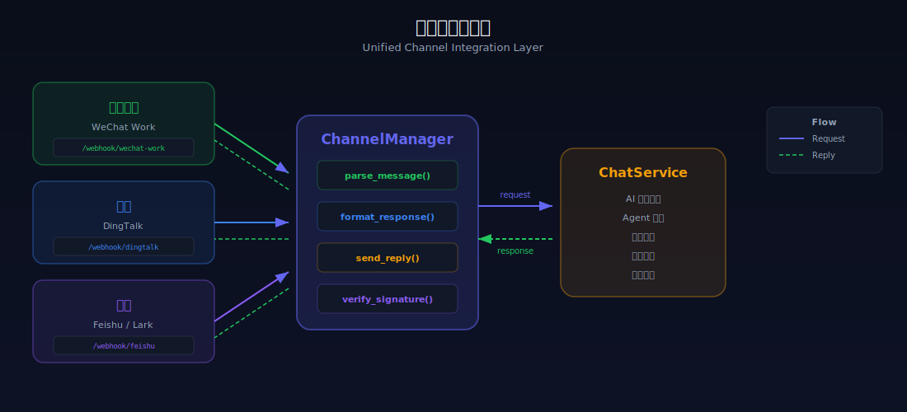
</p>

## 多租户隔离

采用共享数据库、行级隔离的多租户方案：

- **TenantMiddleware** -- 从请求头提取 `X-Tenant-Id`
- **JWT 优先** -- 认证用户的 `tenant_id` 优先于请求头
- **数据隔离** -- 所有业务表包含 `tenant_id` 字段

## LLM Provider

<p align="center">
  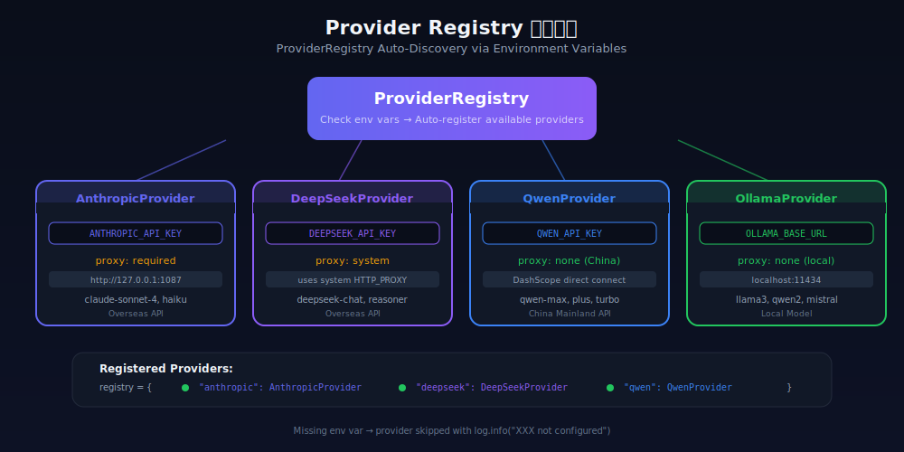
</p>

## 计费架构

<p align="center">
  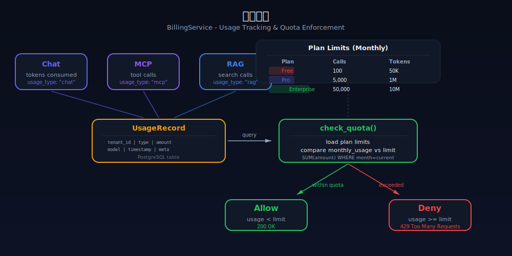
</p>

## 安全设计

<p align="center">
  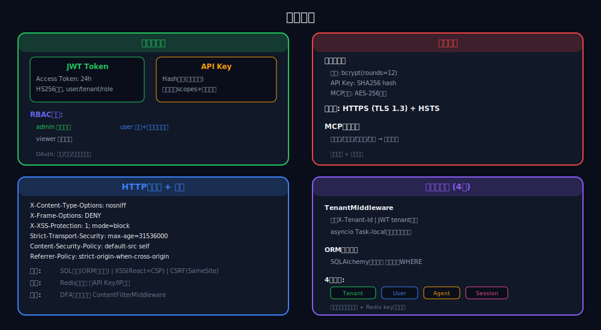
</p>

### 认证

- **JWT** -- 用于 Web 端登录，24 小时有效期
- **API Key** -- 用于第三方集成，支持 hash 存储和权限范围

### 数据安全

- 密码使用 bcrypt (rounds=12) 哈希
- API Key 只存储 hash 值
- MCP 连接器凭据加密存储
- SQL 注入防护（SQLAlchemy ORM 参数化查询）

### HTTP 安全头

通过 `SecurityHeadersMiddleware` 添加：

- `X-Content-Type-Options: nosniff`
- `X-Frame-Options: DENY`
- `X-XSS-Protection: 1; mode=block`
- `Strict-Transport-Security` (HTTPS)
- `Content-Security-Policy`
- `Referrer-Policy`
- `Permissions-Policy`

## 数据库设计

使用 PostgreSQL 16 + pgvector 扩展：

<p align="center">
  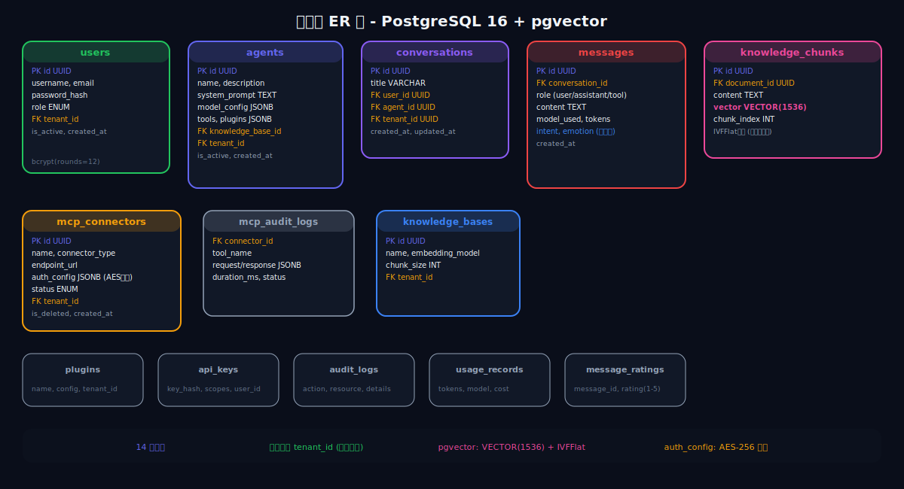
</p>

### 核心表

| 表名 | 说明 |
|------|------|
| `users` | 用户表 |
| `agents` | Agent 配置表 |
| `conversations` | 会话表 |
| `messages` | 消息表（含 intent/emotion 元数据） |
| `mcp_connectors` | MCP 连接器配置 |
| `mcp_audit_logs` | MCP 调用审计日志 |
| `knowledge_bases` | 知识库配置 |
| `knowledge_documents` | 知识库文档 |
| `knowledge_chunks` | 文档切片（含 vector 列） |
| `plugins` | 插件配置 |
| `api_keys` | API Key 管理 |
| `audit_logs` | 统一审计日志 |
| `usage_records` | 用量计费记录 |
| `message_ratings` | 消息评分 |

### 技术选型理由

- **PostgreSQL + pgvector** 而非 MySQL + Milvus -- 一个数据库解决关系型 + 向量检索，运维成本低
- **LangGraph** 而非 LangChain Agent -- 基于状态机，流程可控，支持条件分支和循环
- **Zustand** 而非 Redux -- 代码量少 80%，TypeScript 友好
