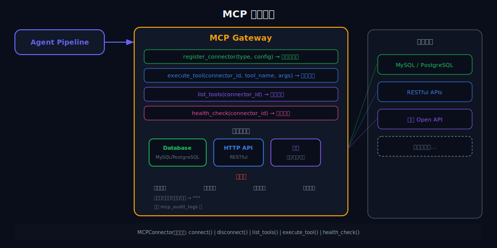
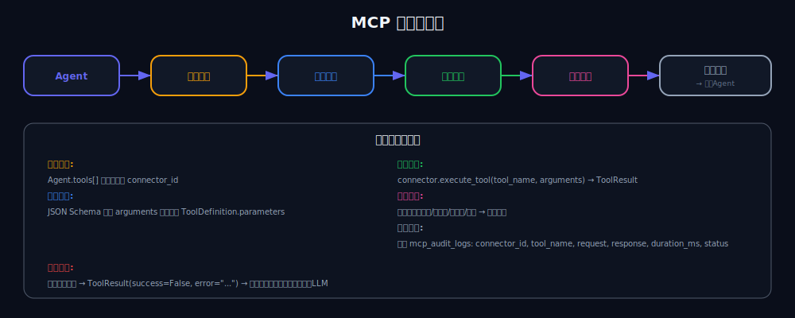
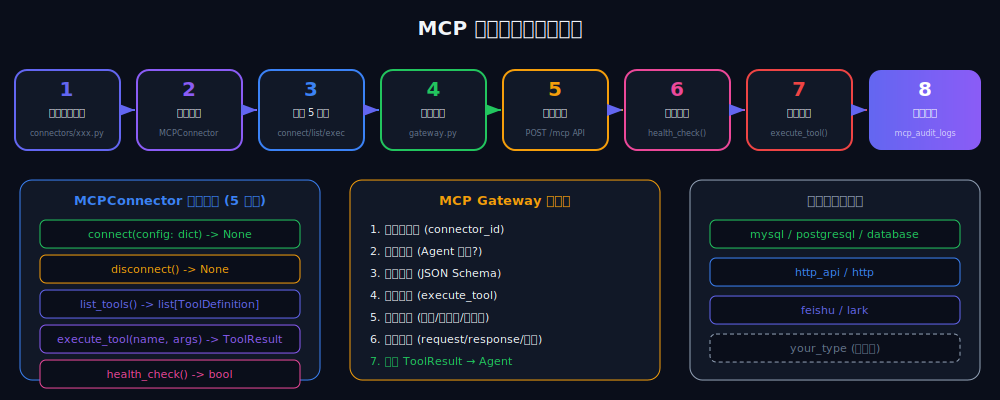

# MCP 连接器开发指南

本文档介绍如何为 BridgeAI 开发自定义 MCP (Model Context Protocol) 连接器，将外部系统接入 Agent 工具链。

<p align="center">
  
</p>

<p align="center">
  
</p>

<p align="center">
  
</p>

## 概述

MCP 连接器是 BridgeAI 连接外部系统的桥梁。Agent 在对话过程中可以通过 MCP 网关调用连接器提供的工具，实现数据库查询、API 调用、IM 消息推送等操作。

### 已有连接器

| 类型 | 说明 | 注册名称 |
|------|------|----------|
| 数据库 | MySQL / PostgreSQL 查询 | `mysql`, `postgresql`, `database` |
| HTTP API | 通用 RESTful API 调用 | `http_api`, `http` |
| 飞书 | 飞书消息/日历/文档操作 | `feishu`, `lark` |

## 快速开始

### 1. 创建连接器文件

在 `backend/app/mcp/connectors/` 下创建新文件：

```python
# mcp/connectors/your_connector.py

import logging
from typing import Any

from app.mcp.connectors.base import MCPConnector, ToolDefinition, ToolResult

logger = logging.getLogger(__name__)


class YourConnector(MCPConnector):
    """你的自定义连接器。"""

    name = "your_connector"
    description = "连接到你的系统"

    def __init__(self) -> None:
        self._client: Any = None
        self._config: dict[str, Any] = {}

    async def connect(self, config: dict[str, Any]) -> None:
        """建立连接。

        config 包含用户在 Web 界面填写的连接信息，
        典型字段包括 endpoint_url、auth_config 等。
        """
        self._config = config
        endpoint = config.get("endpoint_url", "")

        # 初始化你的客户端
        # self._client = YourClient(endpoint, ...)

        logger.info("YourConnector connected to %s", endpoint)

    async def disconnect(self) -> None:
        """断开连接，释放资源。"""
        if self._client is not None:
            # await self._client.close()
            self._client = None
        logger.info("YourConnector disconnected")

    async def list_tools(self) -> list[ToolDefinition]:
        """返回此连接器提供的工具列表。

        每个工具的 parameters 使用 JSON Schema 格式，
        与 OpenAI Function Calling 兼容。
        """
        return [
            ToolDefinition(
                name="query_data",
                description="查询数据",
                parameters={
                    "type": "object",
                    "properties": {
                        "query": {
                            "type": "string",
                            "description": "查询条件",
                        },
                        "limit": {
                            "type": "integer",
                            "description": "返回数量上限",
                            "default": 10,
                        },
                    },
                    "required": ["query"],
                },
            ),
            ToolDefinition(
                name="send_notification",
                description="发送通知",
                parameters={
                    "type": "object",
                    "properties": {
                        "target": {
                            "type": "string",
                            "description": "接收人",
                        },
                        "content": {
                            "type": "string",
                            "description": "通知内容",
                        },
                    },
                    "required": ["target", "content"],
                },
            ),
        ]

    async def execute_tool(
        self, tool_name: str, arguments: dict[str, Any]
    ) -> ToolResult:
        """执行工具调用。

        Args:
            tool_name: 工具名称
            arguments: 调用参数

        Returns:
            ToolResult: 包含 success、data、error 字段
        """
        try:
            if tool_name == "query_data":
                return await self._query_data(arguments)
            elif tool_name == "send_notification":
                return await self._send_notification(arguments)
            else:
                return ToolResult(
                    success=False,
                    error=f"未知工具: {tool_name}",
                )
        except Exception as e:
            logger.error("Tool execution failed: %s", e, exc_info=True)
            return ToolResult(success=False, error=str(e))

    async def health_check(self) -> bool:
        """检查连接是否健康。"""
        try:
            # 执行一个轻量级检查
            # await self._client.ping()
            return True
        except Exception:
            return False

    # ---- 内部方法 ----

    async def _query_data(self, arguments: dict[str, Any]) -> ToolResult:
        query = arguments.get("query", "")
        limit = arguments.get("limit", 10)

        # 实际查询逻辑
        # results = await self._client.query(query, limit=limit)

        results = []  # 替换为实际结果
        return ToolResult(success=True, data=results)

    async def _send_notification(self, arguments: dict[str, Any]) -> ToolResult:
        target = arguments.get("target", "")
        content = arguments.get("content", "")

        if not target or not content:
            return ToolResult(
                success=False,
                error="target 和 content 为必填参数",
            )

        # 实际发送逻辑
        # await self._client.send(target, content)

        return ToolResult(success=True, data={"sent": True})
```

### 2. 注册连接器

在 `mcp/gateway.py` 的 `_CONNECTOR_CLASSES` 字典中添加映射：

```python
from app.mcp.connectors.your_connector import YourConnector

_CONNECTOR_CLASSES: dict[str, type[MCPConnector]] = {
    # ... 已有连接器
    "your_type": YourConnector,
}
```

### 3. 通过 API 创建连接器实例

```bash
curl -X POST http://localhost:8000/api/v1/mcp \
  -H "Authorization: Bearer <token>" \
  -H "Content-Type: application/json" \
  -d '{
    "name": "我的连接器",
    "description": "连接到某个系统",
    "connector_type": "your_type",
    "endpoint_url": "https://api.example.com",
    "auth_config": {
      "api_key": "your-api-key"
    }
  }'
```

## 连接器基类 API

### MCPConnector

| 方法 | 说明 | 必须实现 |
|------|------|:--------:|
| `connect(config)` | 建立连接 | 是 |
| `disconnect()` | 断开连接 | 是 |
| `list_tools()` | 返回工具列表 | 是 |
| `execute_tool(name, args)` | 执行工具 | 是 |
| `health_check()` | 健康检查 | 是 |

### ToolDefinition

```python
@dataclass(frozen=True)
class ToolDefinition:
    name: str           # 工具名称（连接器内唯一）
    description: str    # 工具描述（LLM 用来判断何时调用）
    parameters: dict    # JSON Schema 格式的参数定义
```

### ToolResult

```python
@dataclass(frozen=True)
class ToolResult:
    success: bool           # 是否成功
    data: Any = None        # 返回数据
    error: str | None = None  # 错误信息
```

## MCP 网关工作流程

### 脱敏规则

网关自动对工具返回的数据进行脱敏处理：

| 类型 | 正则 | 替换 |
|------|------|------|
| 手机号 | `1[3-9]\d{9}` | `***手机号***` |
| 身份证 | `\d{17}[\dXx]` | `***身份证***` |
| 银行卡 | `\d{16,19}` | `***银行卡***` |
| 邮箱 | `[\w.]+@[\w.]+` | `***邮箱***` |

## 连接器配置

用户通过 Web 界面或 API 创建连接器时，`config` 和 `auth_config` 会合并传入 `connect()` 方法。

常见配置字段：

```json
{
  "connector_type": "your_type",
  "endpoint_url": "https://api.example.com",
  "api_key": "...",
  "timeout": 30,
  "max_retries": 3
}
```

## 开发规范

1. **错误处理** -- `execute_tool` 中捕获所有异常，返回 `ToolResult(success=False, error=...)` 而不是抛出异常
2. **资源管理** -- `disconnect()` 中确保释放所有资源（连接池、文件句柄等）
3. **健康检查** -- `health_check()` 应执行轻量级检查（如 ping），避免耗时操作
4. **超时控制** -- 外部 API 调用设置合理超时时间
5. **日志安全** -- 不在日志中记录 API Key、密码等敏感信息
6. **不可变结果** -- `ToolDefinition` 和 `ToolResult` 使用 `@dataclass(frozen=True)`
7. **类型注解** -- 所有方法必须包含完整的类型注解

## 测试

```python
# tests/test_your_connector.py
import pytest
from app.mcp.connectors.your_connector import YourConnector


@pytest.fixture
async def connector():
    conn = YourConnector()
    await conn.connect({
        "connector_type": "your_type",
        "endpoint_url": "https://api.example.com",
    })
    yield conn
    await conn.disconnect()


@pytest.mark.asyncio
async def test_list_tools(connector):
    tools = await connector.list_tools()
    assert len(tools) > 0
    for tool in tools:
        assert tool.name
        assert tool.description


@pytest.mark.asyncio
async def test_execute_tool(connector):
    result = await connector.execute_tool("query_data", {"query": "test"})
    assert isinstance(result.success, bool)


@pytest.mark.asyncio
async def test_health_check(connector):
    healthy = await connector.health_check()
    assert isinstance(healthy, bool)


@pytest.mark.asyncio
async def test_unknown_tool(connector):
    result = await connector.execute_tool("nonexistent", {})
    assert result.success is False
    assert result.error is not None
```

## 参考实现

完整的连接器实现可参考以下文件：

- `backend/app/mcp/connectors/mysql_conn.py` -- 数据库连接器
- `backend/app/mcp/connectors/http_api.py` -- HTTP API 连接器
- `backend/app/mcp/connectors/feishu.py` -- 飞书连接器
