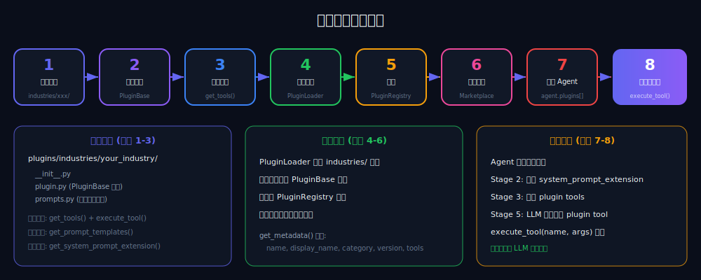

# 插件开发指南

本文档介绍如何为 BridgeAI 开发行业插件，扩展 Agent 的专业能力。

<p align="center">
  
</p>

<p align="center">
  
</p>

## 插件概述

BridgeAI 的插件系统允许开发者为特定行业添加：
- **工具 (Tools)** -- Agent 可调用的功能，如查询汇率、计算税费等
- **提示模板 (Prompt Templates)** -- 行业专属的提示词模板
- **系统提示扩展** -- 当插件启用时自动注入 Agent 系统提示的行业知识

## 快速开始

### 1. 创建插件目录

在 `backend/app/plugins/industries/` 下创建你的行业目录：

```
plugins/industries/
├── ecommerce/         # 已有：跨境电商
├── finance/           # 已有：财税
├── legal/             # 已有：法律
└── your_industry/     # 新插件
    ├── __init__.py
    ├── plugin.py      # 插件主类
    └── prompts.py     # 提示模板（可选）
```

### 2. 实现插件类

继承 `PluginBase` 基类：

```python
# plugins/industries/your_industry/plugin.py

from app.plugins.base import PluginBase, PluginTool, PluginPromptTemplate


class YourIndustryPlugin(PluginBase):
    """你的行业插件。"""

    name = "your_industry"
    display_name = "你的行业"
    description = "描述插件的功能和适用场景"
    version = "1.0.0"
    category = "your_industry"

    def get_tools(self) -> list[PluginTool]:
        """定义插件提供的工具列表。"""
        return [
            PluginTool(
                name="calculate_something",
                description="计算某个行业指标",
                parameters={
                    "type": "object",
                    "properties": {
                        "input_value": {
                            "type": "number",
                            "description": "输入值",
                        },
                        "mode": {
                            "type": "string",
                            "enum": ["standard", "advanced"],
                            "description": "计算模式",
                        },
                    },
                    "required": ["input_value"],
                },
            ),
        ]

    async def execute_tool(self, tool_name: str, arguments: dict) -> dict:
        """执行工具调用。

        Args:
            tool_name: 工具名称（与 get_tools() 中定义的 name 对应）
            arguments: 工具参数

        Returns:
            dict: 必须包含 "success" (bool) 和 "data" 字段
        """
        if tool_name == "calculate_something":
            input_value = arguments.get("input_value", 0)
            mode = arguments.get("mode", "standard")

            result = self._do_calculation(input_value, mode)
            return {"success": True, "data": {"result": result}}

        return {"success": False, "data": None, "error": f"未知工具: {tool_name}"}

    def get_prompt_templates(self) -> list[PluginPromptTemplate]:
        """返回行业专属提示模板。"""
        return [
            PluginPromptTemplate(
                name="industry_analysis",
                description="行业分析报告模板",
                template="请基于以下数据生成{industry}行业分析报告：\n{data}",
            ),
        ]

    def get_system_prompt_extension(self) -> str:
        """当插件启用时，追加到 Agent 系统提示中的内容。"""
        return (
            "你具备{行业}领域的专业知识，可以使用以下专业工具：\n"
            "- calculate_something: 计算行业指标\n"
            "请在回答中体现专业性。"
        )

    def _do_calculation(self, value: float, mode: str) -> float:
        """内部计算逻辑。"""
        if mode == "advanced":
            return value * 1.15
        return value * 1.0
```

### 3. 注册插件

在 `__init__.py` 中导出插件类：

```python
# plugins/industries/your_industry/__init__.py

from .plugin import YourIndustryPlugin

__all__ = ["YourIndustryPlugin"]
```

插件加载器 (`PluginLoader`) 会自动扫描 `industries/` 目录下的所有 `PluginBase` 子类并注册。

## 插件基类 API

### PluginBase

| 属性/方法 | 类型 | 说明 |
|-----------|------|------|
| `name` | `str` | 插件唯一标识符 |
| `display_name` | `str` | 显示名称 |
| `description` | `str` | 插件描述 |
| `version` | `str` | 版本号 |
| `category` | `str` | 行业类别 |
| `get_tools()` | 必须实现 | 返回工具定义列表 |
| `execute_tool()` | 必须实现 | 执行工具调用 |
| `get_prompt_templates()` | 可选 | 返回提示模板列表 |
| `get_system_prompt_extension()` | 可选 | 系统提示扩展内容 |
| `get_metadata()` | 内置 | 序列化插件元数据（用于插件市场展示） |

### PluginTool

```python
@dataclass(frozen=True)
class PluginTool:
    name: str           # 工具名称（唯一标识）
    description: str    # 工具描述（LLM 用来决定是否调用）
    parameters: dict    # JSON Schema 格式的参数定义
```

### PluginPromptTemplate

```python
@dataclass(frozen=True)
class PluginPromptTemplate:
    name: str           # 模板名称
    template: str       # 模板内容（支持 {变量} 占位符）
    description: str    # 模板描述
```

## 工具参数定义

工具的 `parameters` 字段使用 JSON Schema 格式，与 OpenAI Function Calling 兼容：

```python
{
    "type": "object",
    "properties": {
        "query": {
            "type": "string",
            "description": "搜索查询语句",
        },
        "limit": {
            "type": "integer",
            "description": "返回结果数量",
            "default": 10,
        },
        "filters": {
            "type": "object",
            "properties": {
                "category": {"type": "string"},
                "min_price": {"type": "number"},
            },
        },
    },
    "required": ["query"],
}
```

## 已有插件参考

### 跨境电商插件 (ecommerce)

提供工具：
- 汇率查询
- 关税计算
- 物流追踪
- 商品翻译

### 财税插件 (finance)

提供工具：
- 税费计算
- 发票校验
- 财务报表分析

### 法律插件 (legal)

提供工具：
- 法规查询
- 合同条款分析
- 风险评估

## 开发规范

1. **工具命名** -- 使用 snake_case，名称应描述功能（如 `query_exchange_rate`）
2. **参数校验** -- 在 `execute_tool` 中校验必填参数，返回清晰的错误信息
3. **返回格式** -- 始终返回 `{"success": bool, "data": ...}` 格式
4. **异常处理** -- 捕获外部 API 调用异常，不要让异常泄露到上层
5. **不可变数据** -- 使用 `@dataclass(frozen=True)` 定义数据结构
6. **类型注解** -- 所有函数签名必须包含类型注解
7. **日志记录** -- 使用 `logging` 模块，不要使用 `print()`

## 测试

```python
# tests/test_your_plugin.py
import pytest
from app.plugins.industries.your_industry.plugin import YourIndustryPlugin


@pytest.fixture
def plugin():
    return YourIndustryPlugin()


def test_get_tools(plugin):
    tools = plugin.get_tools()
    assert len(tools) > 0
    assert all(t.name and t.description for t in tools)


@pytest.mark.asyncio
async def test_execute_tool(plugin):
    result = await plugin.execute_tool(
        "calculate_something",
        {"input_value": 100, "mode": "standard"},
    )
    assert result["success"] is True
    assert "result" in result["data"]


def test_unknown_tool(plugin):
    import asyncio
    result = asyncio.run(plugin.execute_tool("nonexistent", {}))
    assert result["success"] is False
```
